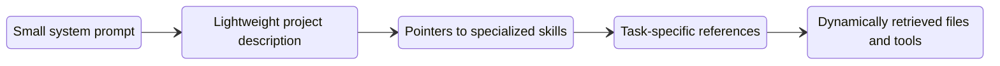

Excessive rules can constrain useful reasoning instead of improving it.

## Avoid

- long system prompts
- repeated instructions
- many examples
- rigid step-by-step workflows
- explicit rules for nearly every edge case
- large context files containing everything the model might need

## Do

General rules to define:

- what you prefer
- what "good" looks like to you
- which compromises are acceptable
- which historical decisions matter
- which unwritten conventions govern the project
- whether the problem should be solved differently
- scope constraints, safety constraints, verification criteria, user intent

For a given task define the following:

- the desired outcome
- the reason for the task
- local exceptions and unusual constraints
- tests and verification criteria
- references representing your taste
- irreversible-action boundaries

## Comparison of Harness types

AI Agents should be allowed to discover rules.

### Legacy Harness

- Tries to enumerate acceptable actions
- Defines specific principles with rulesets of the form:
```txt
Never do...
Always do...
```
- Gives examples of tool calls
- Use large system prompts
	- coding rules
	- review procedures
	- documentation standards
	- deployment instructions
	- testing instructions
	- tool descriptions
	- every possible organizational policy

### Modern Harness

- Describe what determines acceptability.
- Defines general principles using rulesets of the form:
```txt
Match the conventions of the surrounding code.
Preserve existing public interfaces.
Do not introduce unrelated changes.
```
- Provide tools that are AI friendly:
	1. meaningful function names
	2. clear parameter descriptions
	3. constrained enumerations
	4. explicit state transitions
	5. informative tool results
	6. tools that expose the right degrees of freedom
- Only provides high-level context; Agent loads specialized instructions in skills when they become relevant:



## Example Plan

```mermaid
stateDiagram-v2
    direction LR
    state "Discover unknowns" as discover
    state "Brainstorm alternatives" as brainstorm
    state "Prototype" as prototype
    state "Interview the user" as interview
    state "Study references" as study
    state "Create a reviewable plan" as plan
    state "Implement" as implement
    state "Record deviations" as record_deviations
    state "Explain and verify" as explain

    discover --> brainstorm
    brainstorm --> prototype
    prototype --> interview
    interview --> study
    study --> plan
    plan --> implement
    implement --> record_deviations
    record_deviations --> explain
```



The agent should maintain notes about:
- deviations from the plan
- edge cases discovered
- assumptions made
- conservative choices
- lessons for later attempts
- progress report
- implement unit tests and verifications
- implementation notes
- explainer documents
- quizzes and summaries for humans

## User Interviews

The agent should ask the user for the following actions:
- changes in architecture
- substantial changes
- when the answer can save the agent expensive work

The agents should not ask the user when the answer can be determined from readily available sources.

## Responsibilities

| Human responsibilities | AI  responsibilities          |
| ---------------------- | ----------------------------- |
| Objective              | Search strategy               |
| Success criteria       | Implementation sequence       |
| Scope boundaries       | Tool selection                |
| Taste and trade-offs   | Local technical decisions     |
| Irreversible actions   | Reversible exploration        |
| Final acceptance       | Iteration and self-correction |

## Examples

Legacy instructions (defines process):
```txt
Read this paper.
First summarize the abstract.
Then explain every section.
Then define every term.
Then analyze every equation.
Then discuss every table.
Do not skip anything.
Use exactly ten sections.
```

Modern instructions (defines outcome/goal):
```txt
My objective is to identify the paper's genuine scientific delta, not merely summarize it.

Audience: technically sophisticated viewers who understand transformers but have not studied this method.

First perform a blind-spot pass:
- What background concepts must be understood?
- Which claims are genuinely new?
- Which claims are mostly reframing?
- What evidence would falsify the central interpretation?
```

## Sources

- [Opus 5 Changes How We Use AI & Harness Claude Code](https://www.youtube.com/watch?v=zmELzKKgdIo)
