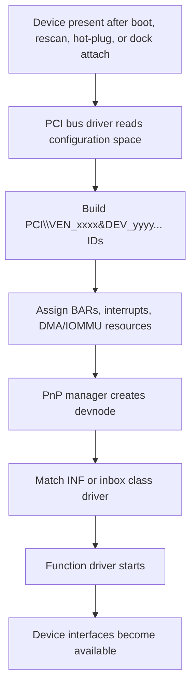

PCI Express devices are discovered through PCI configuration space rather than USB descriptors. The PCI bus driver enumerates buses, devices, and functions, reads standardized configuration registers, and reports Plug and Play IDs to Windows.

The important identity fields are:

| Field | Purpose |
|---|---|
| Vendor ID | Identifies the PCI-SIG assigned vendor |
| Device ID | Identifies the vendor’s device |
| Revision ID | Identifies the hardware revision |
| Subsystem vendor ID | Identifies the board or subsystem vendor |
| Subsystem ID | Identifies the board or subsystem product |
| Class code | Identifies the kind of function, such as network, display, storage, bridge |

Windows documents the PCI hardware ID formats generated by the PCI bus driver. Typical IDs look like:

```text
PCI\VEN_8086&DEV_1234&SUBSYS_567890AB&REV_01
PCI\VEN_8086&DEV_1234&SUBSYS_567890AB
PCI\VEN_8086&DEV_1234&CC_010802
PCI\VEN_8086&DEV_1234&CC_0108
```

The IDs are ordered from more specific to more general so driver matching can prefer an exact device/subsystem/revision match, then fall back to broader compatible class-style matches. ([Microsoft Learn](https://learn.microsoft.com/en-us/windows-hardware/drivers/install/identifiers-for-pci-devices), [Microsoft Learn](https://learn.microsoft.com/en-us/windows-hardware/drivers/kernel/irp-mn-query-id))

## Enumeration flow



## Resources

PCIe devices expose Base Address Registers (BARs), interrupt capabilities, power-management capabilities, and optional extended capabilities. PnP does not only pick a driver; it also coordinates resource assignment so the driver knows which MMIO ranges, interrupts, and DMA protections belong to the device.

Examples:

```text
GPU             -> PCI display-class device, vendor display driver
Ethernet NIC    -> PCI network controller, inbox or vendor NIC driver
NVMe SSD        -> PCI storage controller, NVMe storage stack
Wi-Fi adapter   -> PCI network controller, vendor or inbox Wi-Fi driver
Thunderbolt NIC -> tunneled PCIe function, still enumerated as PCI
```

## Hot-plug and connectors

Internal PCIe devices are often discovered during boot. PCIe can also be hot-plugged when the platform supports it, such as with server slots, docks, Thunderbolt, or USB4/Thunderbolt PCIe tunneling. In those cases, the connector may be external, but the function Windows sees can still be a PCI device with `PCI\VEN_...` IDs.

M.2 is a good example of why connector and bus should not be confused. An M.2 slot can carry PCIe, SATA, USB, SMBus, and sideband signals depending on the key and motherboard wiring. A device in the slot is enumerated by the actual protocol it uses.

## Driver matching

PCIe device drivers normally bind through INF entries that match one or more PCI IDs. A vendor driver might match a very specific subsystem ID. A class driver might match a broader class code.

The practical debugging step is to read the actual hardware IDs:

```powershell
pnputil /enum-devices /bus PCI /deviceids
```

Then compare those IDs with the INF or driver package you expect to load.

## See also

- [[Plug and Play]]
- [[Plug and Play]]
