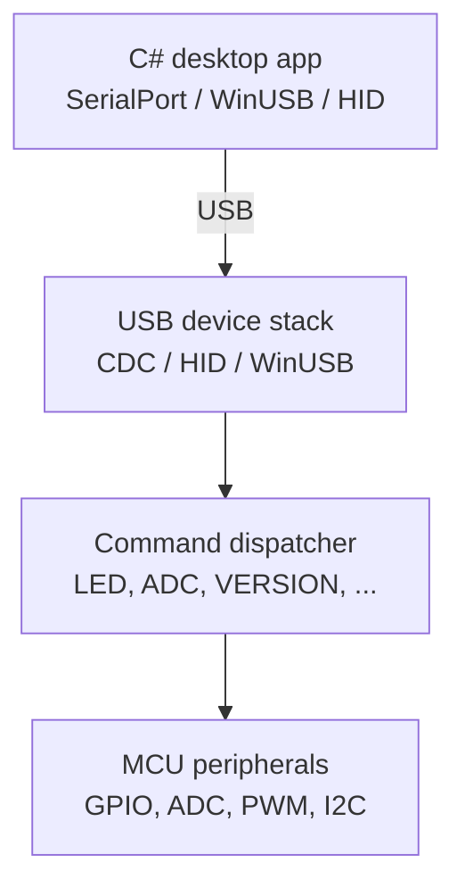

Once a microcontroller enumerates and the operating system has loaded a driver or exposed a user-space access path, the next design problem is the device protocol. Keep the application protocol separate from the USB transport so a first [[USB CDC ACM]] prototype can later move to [[USB HID]], [[WinUSB]], Linux `libusb`, or a custom kernel driver without rewriting the whole application.

## Minimal architecture



## Text protocol

A line-oriented text protocol is good for development:

```text
PING
LED 1
LED 0
ADC 0
PWM 2 128
VERSION
```

Responses:

```text
OK
ERR UnknownCommand
ADC 0 2473
VERSION 0.1.0
```

Pros:

```text
human-readable
easy to test with PuTTY / Tera Term / PowerShell
simple firmware parsing
```

Cons:

```text
less compact
annoying escaping rules for binary data
```

Do not keep ad-hoc strings forever unless the interface is only a debug console. Once the command set matters, write down the grammar, response model, timeouts, and error codes.

## Binary framed protocol

A binary framed protocol is better once throughput, binary payloads, or strict parsing matter:

```text
[0xAA][Length][Command][Payload...][CRC16]
```

Example:

```text
AA 03 10 01 00 C1 7A
```

Where:

```text
0xAA       sync byte
0x03       payload length
0x10       command: set LED
0x01 0x00  payload
0xC17A     CRC16
```

Include at least:

```text
version command
ping command
sequence number
error codes
timeout handling
CRC or checksum if using raw transport
firmware update strategy, if needed
```

## C# host transport

Do not bind application logic directly to `SerialPort`. Wrap the transport first:

```csharp
public interface DeviceTransport : IAsyncDisposable
{
    Task ConnectAsync(CancellationToken cancellationToken);
    Task WriteAsync(ReadOnlyMemory<byte> data, CancellationToken cancellationToken);
    Task<int> ReadAsync(Memory<byte> buffer, CancellationToken cancellationToken);
}
```

Then the concrete transports can change independently:

```text
SerialDeviceTransport
WinUsbDeviceTransport
HidDeviceTransport
MockDeviceTransport
```

The higher-level protocol layer should not care whether the device currently uses CDC, HID, or WinUSB.

For a line-based CDC prototype:

```csharp
using System.IO.Ports;

public sealed class MicrocontrollerClient
{
    private readonly SerialPort _serialPort;

    public MicrocontrollerClient(string portName)
    {
        _serialPort = new SerialPort(portName, 115200)
        {
            NewLine = "\n",
            ReadTimeout = 1000,
            WriteTimeout = 1000
        };
    }

    public void Open()
    {
        _serialPort.Open();
    }

    public string SendCommand(string command)
    {
        _serialPort.WriteLine(command);
        return _serialPort.ReadLine();
    }
}
```

Usage:

```csharp
var client = new MicrocontrollerClient("COM7");

client.Open();

Console.WriteLine(client.SendCommand("PING"));
Console.WriteLine(client.SendCommand("LED 1"));
Console.WriteLine(client.SendCommand("ADC 0"));
```

## Firmware command loop

```c
while (true)
{
    if (usb_line_available())
    {
        char line[64];
        usb_read_line(line, sizeof(line));

        if (strcmp(line, "PING") == 0)
        {
            usb_write_line("PONG");
        }
        else if (strcmp(line, "LED 1") == 0)
        {
            gpio_set(LED_PIN, true);
            usb_write_line("OK");
        }
        else if (strcmp(line, "LED 0") == 0)
        {
            gpio_set(LED_PIN, false);
            usb_write_line("OK");
        }
        else if (starts_with(line, "ADC "))
        {
            int channel = parse_channel(line);
            int value = adc_read(channel);

            char response[32];
            snprintf(response, sizeof(response), "ADC %d %d", channel, value);
            usb_write_line(response);
        }
        else
        {
            usb_write_line("ERR UnknownCommand");
        }
    }
}
```

## VID/PID issue

For experiments, many development boards already have usable USB IDs from the board vendor or firmware stack.

For a real distributed product, do not invent a random vendor ID. USB vendor IDs are assigned by the USB-IF. Some open-source or small-project communities allocate product IDs under shared vendor IDs, but the rules vary and must be checked carefully.

For internal prototypes, the main risk is ID collision. For shipping devices, VID/PID ownership is part of the product identity and driver binding story.

## See also

- [[USB Plug and Play]]
- [[USB Driver Choices for Microcontrollers]]
- [[USB CDC ACM]]
- [[USB HID]]
- [[WinUSB]]
- [[Custom Linux Device Drivers]]
