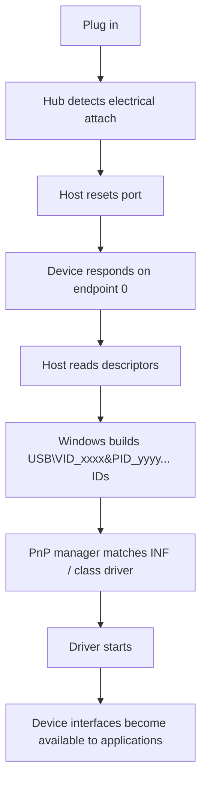

This article uses USB as the concrete Plug and Play example. For the same idea across PCIe, ACPI-described onboard devices, storage buses, Bluetooth, and legacy connectors, see [[Plug and Play]].

## Physical attach detection

When you plug in a USB device, the host/hub detects that something is electrically present.

For classic USB 1.x/2.0, the device indicates speed using pull-up resistors on the data lines:

|Signal|Meaning|
|---|---|
|Pull-up on `D+`|Full-speed device|
|Pull-up on `D-`|Low-speed device|
|High-speed|Starts as full-speed, then negotiates high-speed during reset/chirp|

For USB-C, the initial attach/orientation/power-role detection happens on the **CC pins**, but the actual USB device identity still comes later from USB descriptors.

## Bus reset and default address

The host/hub resets the port. After reset, the device is in the USB **Default** state and listens at USB address `0`.

At this point the host can talk only to **endpoint 0**, the default control endpoint. Every USB device must implement endpoint 0.

## The host asks for descriptors

The host sends standard USB control requests such as:

```text
GET_DESCRIPTOR(Device)
SET_ADDRESS
GET_DESCRIPTOR(Configuration)
GET_DESCRIPTOR(String)
SET_CONFIGURATION
```

The key point: the host asks; the device replies.

The **device descriptor** contains the core identity fields:

```c
idVendor        // USB vendor ID, assigned by USB-IF
idProduct       // Product ID, assigned by the vendor
bcdDevice       // Device revision
bDeviceClass
bDeviceSubClass
bDeviceProtocol
iManufacturer   // string descriptor index
iProduct        // string descriptor index
iSerialNumber   // string descriptor index
```

Microsoft’s USB documentation explicitly says Windows uses `idVendor`, `idProduct`, and `bcdDevice` from the USB device descriptor to generate USB hardware and compatible IDs. ([Microsoft Learn](https://learn.microsoft.com/en-us/windows-hardware/drivers/usbcon/standard-usb-descriptors "Standard USB Descriptors - Windows drivers"))

## Windows creates Plug and Play IDs

Once Windows has the descriptors, the USB hub/USB stack reports a device to the Windows Plug and Play manager. Windows then generates hardware IDs and compatible IDs. Microsoft describes this as the Windows USB stack enumerating the device, extracting descriptors, and generating hardware IDs and compatible IDs. ([Microsoft Learn](https://learn.microsoft.com/en-us/windows-hardware/drivers/hid/plug-and-play-support "Plug and Play Support - Windows drivers | Microsoft Learn"))

For a simple USB device, typical hardware IDs look like:

```text
USB\VID_1234&PID_5678&REV_0100
USB\VID_1234&PID_5678
```

Compatible IDs may look like:

```text
USB\Class_03&SubClass_01&Prot_01
USB\Class_03&SubClass_01
USB\Class_03
```

For example, a boot keyboard is usually HID class:

```text
bInterfaceClass    = 0x03   // HID
bInterfaceSubClass = 0x01   // Boot interface
bInterfaceProtocol = 0x01   // Keyboard
```

Windows uses hardware IDs to match a device to an INF/driver package; Microsoft defines a hardware ID as a vendor-defined identification string used for driver matching. ([Microsoft Learn](https://learn.microsoft.com/en-us/windows-hardware/drivers/install/hardware-ids "Hardware ID - Windows drivers | Microsoft Learn"))

## Device instance identity

After driver matching, Windows also needs to distinguish **this particular physical instance** from another device with the same VID/PID.

That is where the USB serial number matters.

Typical device instance path:

```text
USB\VID_1234&PID_5678\A1B2C3D4
```

Here:

```text
USB\VID_1234&PID_5678
```

is the device ID, and:

```text
A1B2C3D4
```

is usually the USB serial string.

Microsoft describes an instance ID as a string reported by the bus driver that distinguishes devices of the same type; it may contain serial number information if the bus supports it, otherwise location information is used. ([Microsoft Learn](https://learn.microsoft.com/en-us/windows-hardware/drivers/install/instance-ids "Instance ID - Windows drivers | Microsoft Learn"))

So if your firmware provides a **valid, unique `iSerialNumber`**, Windows can recognize the same unit across ports. If not, Windows often ties the instance to the physical port/topology instead. Microsoft’s USB registry docs also note an `IgnoreHWSerNum` setting that forces Windows to ignore the serial number and bind the device instance to the port. ([Microsoft Learn](https://learn.microsoft.com/en-us/windows-hardware/drivers/usbcon/usb-device-specific-registry-settings "USB Device Registry Entries - Windows drivers | Microsoft Learn"))

## Composite devices

A USB device can expose multiple interfaces. Example:

```text
Interface 0: HID keyboard
Interface 1: HID mouse
Interface 2: vendor-specific debug interface
```

Such a device is a **composite device**. Windows may create a parent USB composite devnode and then separate child devnodes per interface.

Typical interface-specific ID:

```text
USB\VID_1234&PID_5678&MI_00
USB\VID_1234&PID_5678&MI_01
```

`MI_00` means “interface zero”. Microsoft’s Plug and Play USB documentation describes this composite-device path and says the hub driver creates a physical device object and notifies the OS that its child devices changed. ([Microsoft Learn](https://learn.microsoft.com/en-us/windows-hardware/drivers/hid/plug-and-play-support "Plug and Play Support - Windows drivers | Microsoft Learn"))

## What a USB device must implement

For your own microcontroller-based USB device, the firmware must provide at least:

|Descriptor|Purpose|
|---|---|
|Device descriptor|VID/PID, device class, USB version, serial string index|
|Configuration descriptor|Power usage, number of interfaces|
|Interface descriptor|Class/subclass/protocol per function|
|Endpoint descriptors|Bulk/interrupt/isochronous endpoints|
|String descriptors|Manufacturer, product, serial number|
|Optional BOS descriptor|USB 2.1+, WebUSB, MS OS descriptors, capabilities|

The important design choice is the **USB class**:

|Device type|Usual choice|
|---|---|
|Keyboard/mouse/game controller|HID|
|Virtual COM port|CDC ACM|
|Mass storage|Mass Storage Class|
|Audio device|USB Audio Class|
|Custom protocol|WinUSB or vendor-specific class|
|Multiple functions|Composite device|

For a custom device on Windows, the clean modern route is often:

```text
Vendor-specific interface + Microsoft OS descriptors + WinUSB
```

That avoids writing a kernel driver in many cases.

For the practical driver choice after enumeration, see [[USB Driver Choices for Microcontrollers]]. For protocol and application architecture after the driver is loaded, see [[USB Device Protocol Design]].

## Mental model

The real flow is:


