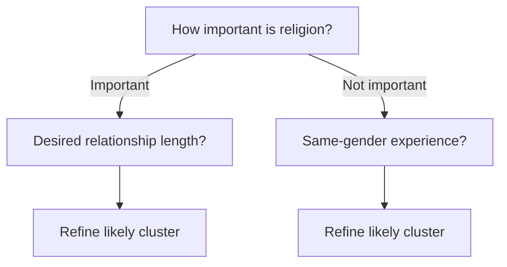

---
title: OkCupid Question Selection Algorithm
---
The **original OkCupid question selection algorithm** ranked unanswered questions before it presented them to a user. OkCupid's archived technical explanation gives one design rule: it sorted questions by how well they divided the population, then usually showed users the best questions that they had not answered.

OkCupid did not publish the exact ranking formula. Entropy, information gain, and the decision-tree procedure in this article are evidence-based reconstructions. They are not disclosed OkCupid implementation details.

## Documented behavior

The population split rule has a clear purpose. A question gives little population information when almost everyone selects the same answer. A question gives more information when its answers divide users into balanced groups.

The selector and the [[OkCupid Matching Algorithm]] have different objectives:

- The selector tries to collect informative answers early.
- The matcher calculates compatibility for a pair from questions that both users answered.
- A question can divide the population well but have low personal importance.
- A rare deal-breaker can have high personal importance but divide the full population poorly.

## Entropy reconstruction

Let question $q$ have $k$ possible answers. Let $p_i$ be the population proportion that selects answer $i$. Shannon entropy measures how evenly the answers divide the population:

$$
H(A_q) = -\sum_{i=1}^{k} p_i \log_2 p_i
$$

The maximum is $\log_2 k$ when all answers are equally common. A normalized score supports comparisons between questions with different answer counts:

$$
H_{norm}(A_q) = \frac{H(A_q)}{\log_2 k}
$$

A practical ranking can also include the response rate $r_q$:

$$
Score(q) = r_q H_{norm}(A_q)
$$

This term reduces the rank of a balanced question that most users skip. OkCupid did not disclose this equation. It is a simple implementation of the published population-division rule.

## Cluster-aware question selection

A global population split is not always the most useful split. If the goal is to identify a latent user cluster $C$, select the question with the largest mutual information:

$$
q^* = \arg\max_q I(A_q; C)
$$

After the user answers the first question, the next question can depend on the answer history $R$:

$$
q_{next}^* = \arg\max_q I(A_q; C \mid R)
$$

This is similar to an entropy-based decision tree. Each answer changes which question has the highest expected information gain.

The example only shows how an adaptive tree can work. It is not a published OkCupid tree.

## Chris McKinlay's independent analysis

Chris McKinlay performed an independent analysis of scraped OkCupid data in 2012. WIRED reports that he collected approximately six million question-answer records from 20,000 women. He used a modified k-modes algorithm to find seven categorical clusters. A second sample of 5,000 active users produced a similar cluster structure.

McKinlay then selected 500 questions that were popular in two target clusters. He used adaptive boosting to select importance weights for his own profiles. This was a method to optimize his use of OkCupid. It was not OkCupid's internal question selector.

The WIRED cluster visualization included these four questions:

1. About how long do you want your next relationship to last?
2. How long before you have sex with someone you really like?
3. Have you ever had a sexual encounter with someone of the same sex?
4. How important is religion or God in your life?

The religion question is a strong candidate for an early cluster split in that visualization. One cluster is separated by high religious importance, another is intermediate, and most other clusters are near the low-religion end. McKinlay also rejected one cluster as too Christian for his target.

This evidence does not prove that religion was the single most informative OkCupid question. WIRED described the displayed questions as popular questions, not as a mathematical ranking by mutual information. The raw cluster contingency table is not public, so the exact information gain cannot be calculated from the article.

## Better production objectives

A production selector can combine several objectives:

$$
Utility(q) =
\alpha InformationGain(q)
+ \beta ResponseProbability(q)
+ \gamma MatchImpact(q)
- \delta Redundancy(q)
- \epsilon SensitivityCost(q)
$$

This design can avoid repetitive questions, control sensitive topics, and prefer questions that users are likely to answer. It can also add exploration so that new questions receive enough answers for evaluation.

## Related and alternative algorithms

- [ID3 decision-tree induction](https://doi.org/10.1007/BF00116251) selects splits by information gain.
- [Decision trees in scikit-learn](https://scikit-learn.org/stable/modules/tree.html) support entropy and other split criteria.
- [Mutual information](https://scikit-learn.org/stable/modules/generated/sklearn.metrics.mutual_info_score.html) measures dependence between categorical variables.
- [Active learning](https://minds.wisconsin.edu/handle/1793/60660) selects examples or questions that reduce model uncertainty.
- [Computerized adaptive testing](https://pmc.ncbi.nlm.nih.gov/articles/PMC4520411/) uses item response theory to select questions for ability estimation.
- [k-modes clustering](https://doi.org/10.1023/A:1009769707641) groups categorical records and was the basis of McKinlay's cluster analysis.
- [[K-means Clustering]] is a related method for numeric data, but it is not a direct substitute for categorical answers.
- [[Hybrid Recommenders]] can combine explicit answers, profile features, and behavior.

## Sources

- [OkCupid FAAAQ: documented population-division rule](https://web.archive.org/web/20110103221822/http://www.okcupid.com/faaaq)
- [How a Math Genius Hacked OkCupid to Find True Love](https://www.wired.com/2014/01/how-to-hack-okcupid/)
- [OkTrends: user-selected questions and importance](https://gwern.net/doc/psychology/okcupid/howracesandreligionsmatchinonlinedating.html)
- [Current OkCupid overview of matching questions](https://okcupid-app.zendesk.com/hc/en-us/articles/22982200783771-How-Does-OkCupid-Work-Our-Complete-Guide-to-Match-Questions-the-Algorithm-and-Setting-Up-Your-Account)
