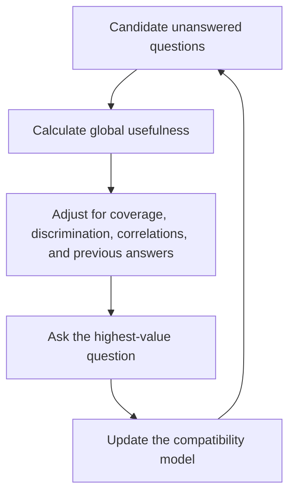

The **original OkCupid question selection algorithm** ranked unanswered questions before it presented them to a user. OkCupid's archived technical explanation gives one design rule: it sorted questions by how well they divided the population, then usually showed users the best questions that they had not answered.

OkCupid did not publish the exact ranking formula. Entropy, information gain, and the decision-tree procedure in this article are evidence-based reconstructions. They are not disclosed OkCupid implementation details.

## Published behavior

OkCupid's archived 2011 FAAAQ states that the service sorted questions by how well they divided the population. It then usually showed each user the best questions that the user had not answered.

A 2013 investigation gives a compatibility-specific description. Founder Sam Yagan said that questions were "ranked algorithmically by the amount of information they add to our estimate of your compatibility." The author created several profiles. She found that the early question set was largely consistent, but previous answers could move later questions forward or backward.

The question pool was much larger than any user could answer:

| Report | Question-pool size | Evidence quality |
| --- | ---: | --- |
| OkTrends, February 2011 | 275,294 match questions | Exact count from OkCupid's own data analysis |
| Casey Johnston, July 2013, referring to approximately two years earlier | "Some 257,000" questions | Approximate retrospective statement in a secondary article |

The direct OkTrends figure is the stronger count. The later article does not give a 2013 inventory. It refers to approximately two years earlier, and its rounded figure is lower than the exact OkTrends count. The figures therefore do not show a decrease from 2011 to 2013.

OkCupid described the question database as ever-changing. New user submissions could increase the catalog, while moderation, deduplication, or retirement could reduce it. This behavior is plausible for a user-submitted catalog, but the cited sources do not document which changes caused the difference between the two reported figures. They only establish that the pool contained hundreds of thousands of questions.

The population split rule has a clear purpose. A question gives little population information when almost everyone selects the same answer. A question gives more information when its answers divide users into balanced groups. Yagan's description adds another objective: the answers must also improve the compatibility estimate.

The selector and the [[OkCupid Matching Algorithm]] have different objectives:

- The selector tries to collect informative answers early.
- The matcher calculates compatibility for a pair from questions that both users answered.
- A question can divide the population well but have low personal importance.
- A rare deal-breaker can have high personal importance but divide the full population poorly.

## Entropy reconstruction

Let question $q$ have $k$ possible answers. Let $p_i$ be the population proportion that selects answer $i$. Shannon entropy measures how evenly the answers divide the population:

$$
H(A_q) = -\sum_{i=1}^{k} p_i \log_2 p_i
$$

The maximum is $\log_2 k$ when all answers are equally common. A normalized score supports comparisons between questions with different answer counts:

$$
H_{norm}(A_q) = \frac{H(A_q)}{\log_2 k}
$$

A practical ranking can also include the response rate $r_q$:

$$
Score(q) = r_q H_{norm}(A_q)
$$

This term reduces the rank of a balanced question that most users skip. OkCupid did not disclose this equation. It is a simple implementation of the published population-division rule.

## Discrimination, coverage, and match impact

Balanced answers are not sufficient. Consider two illustrative questions:

- **Do you think murder is bad?** If almost everyone gives and accepts the same answer, the question separates almost nobody.
- **Would you prefer an open relationship?** If answers are divided and many users reject the opposite answer, the question can separate a large part of the candidate population.

A useful question can therefore depend on several factors:

$$
Usefulness(q) \sim
Discrimination(q)
\times Coverage(q)
\times MatchImpact(q)
\times PredictiveValue(q)
$$

This is a conceptual decomposition, not a published OkCupid equation. Coverage matters because the [[OkCupid Matching Algorithm]] uses only questions that both users answered. A question that few users answer contributes to few pair comparisons, even if its answer distribution is balanced.

$MatchImpact(q)$ can include how often users reject alternative answers and how much importance they assign to the question. This separates answer diversity from actual effect on a pair score.

## Compatibility information-gain reconstruction

Let $D$ be the answers already known about a user. Let $M$ be the user's compatibility distribution across possible matches. A compatibility-specific selector can rank a candidate question by its expected reduction in uncertainty:

$$
IG(q) = H(M \mid D)
- \mathbb{E}_{a_q}\left[H(M \mid D, A_q = a_q)\right]
$$

This formula matches the intent of Yagan's description: select the next question that is expected to change the compatibility estimate the most. It does not prove that OkCupid calculated Shannon entropy or used this exact equation.

## Adaptive and cluster-aware question selection

A global population split is not always the most useful split. If the goal is to identify a latent user cluster $C$, select the question with the largest mutual information:

$$
q^* = \arg\max_q I(A_q; C)
$$

After the user answers the first question, the next question can depend on the answer history $R$:

$$
q_{next}^* = \arg\max_q I(A_q; C \mid R)
$$

This is similar to an entropy-based decision tree. Each answer changes which question has the highest expected information gain. The 2013 profile experiment provides evidence that the production order was at least partly adaptive.

The flow shows a modern reconstruction. It is not a published OkCupid implementation.

## Proxy questions and feature selection

An informative question does not need to cause compatibility. It can act as a proxy for other answers. In a 2011 OkTrends analysis, the answer to "Do you like the taste of beer?" was the best predictor among casual topics of whether the same person accepted sex on a first date. OkCupid also used answer diversity when it selected useful first-date questions.

This correlation does not prove that the product always ranked the beer question early. It shows why a question that appears superficial can carry information about a more sensitive preference.

This is a feature-selection problem. Let $X_1, X_2, \ldots, X_p$ be all candidate questions. Select a smaller set $X_K$ such that:

$$
P(M \mid X_K) \approx P(M \mid X_1, X_2, \ldots, X_p)
$$

If a small answer set approximates the compatibility estimate from hundreds of answers, the system can collect useful data with less user effort.

## Chris McKinlay's independent analysis

Chris McKinlay performed an independent analysis of scraped OkCupid data in 2012. WIRED reports that he collected approximately six million question-answer records from 20,000 women. He used a modified k-modes algorithm to find seven categorical clusters. A second sample of 5,000 active users produced a similar cluster structure.

McKinlay's first question choices were relatively unpopular. Because OkCupid compared only shared questions, this gave him limited coverage with the women he wanted to find. He then selected 500 questions that were popular in two target clusters. He used adaptive boosting to select importance weights for his own profiles. This was a method to optimize his use of OkCupid. It was not OkCupid's internal question selector.

The WIRED cluster visualization included these four questions:

1. About how long do you want your next relationship to last?
2. How long before you have sex with someone you really like?
3. Have you ever had a sexual encounter with someone of the same sex?
4. How important is religion or God in your life?

The religion question is a strong candidate for an early cluster split in that visualization. One cluster is separated by high religious importance, another is intermediate, and most other clusters are near the low-religion end. McKinlay also rejected one cluster as too Christian for his target.

This evidence does not prove that religion was the single most informative OkCupid question. WIRED described the displayed questions as popular questions, not as a mathematical ranking by mutual information. The raw cluster contingency table is not public, so the exact information gain cannot be calculated from the article.

## Better production objectives

A production selector can combine several objectives:

$$
Utility(q) =
\alpha InformationGain(q)
+ \beta ResponseProbability(q)
+ \gamma MatchImpact(q)
- \delta Redundancy(q)
- \epsilon SensitivityCost(q)
$$

This design can avoid repetitive questions, control sensitive topics, and prefer questions that users are likely to answer. It can also add exploration so that new questions receive enough answers for evaluation.

## Related and alternative algorithms

- [ID3 decision-tree induction](https://doi.org/10.1007/BF00116251) selects splits by information gain.
- [Decision trees in scikit-learn](https://scikit-learn.org/stable/modules/tree.html) support entropy and other split criteria.
- [Mutual information](https://scikit-learn.org/stable/modules/generated/sklearn.metrics.mutual_info_score.html) measures dependence between categorical variables.
- [Active learning](https://minds.wisconsin.edu/handle/1793/60660) selects examples or questions that reduce model uncertainty.
- [Computerized adaptive testing](https://pmc.ncbi.nlm.nih.gov/articles/PMC4520411/) uses item response theory to select questions for ability estimation.
- [k-modes clustering](https://doi.org/10.1023/A:1009769707641) groups categorical records and was the basis of McKinlay's cluster analysis.
- [[K-means Clustering]] is a related method for numeric data, but it is not a direct substitute for categorical answers.
- [[Hybrid Recommenders]] can combine explicit answers, profile features, and behavior.

## Sources

- [[OkTrends - Rape Fantasies and Hygiene By State]]
- [[OkTrends - The Best Questions For A First Date]]
- [OkCupid FAAAQ: documented population-division rule](https://web.archive.org/web/20110103221822/http://www.okcupid.com/faaaq)
- [The OKCupid Question You're Answering Wrong](https://medium.com/ladybits-on-medium/the-okcupid-question-youre-answering-wrong-b3b502925697)
- [OkTrends: The Best Questions For A First Date](https://gwern.net/doc/psychology/okcupid/thebestquestionsforafirstdate.html)
- [How a Math Genius Hacked OkCupid to Find True Love](https://www.wired.com/2014/01/how-to-hack-okcupid/)
- [OkTrends: user-selected questions and importance](https://gwern.net/doc/psychology/okcupid/howracesandreligionsmatchinonlinedating.html)
- [Current OkCupid overview of matching questions](https://okcupid-app.zendesk.com/hc/en-us/articles/22982200783771-How-Does-OkCupid-Work-Our-Complete-Guide-to-Match-Questions-the-Algorithm-and-Setting-Up-Your-Account)
