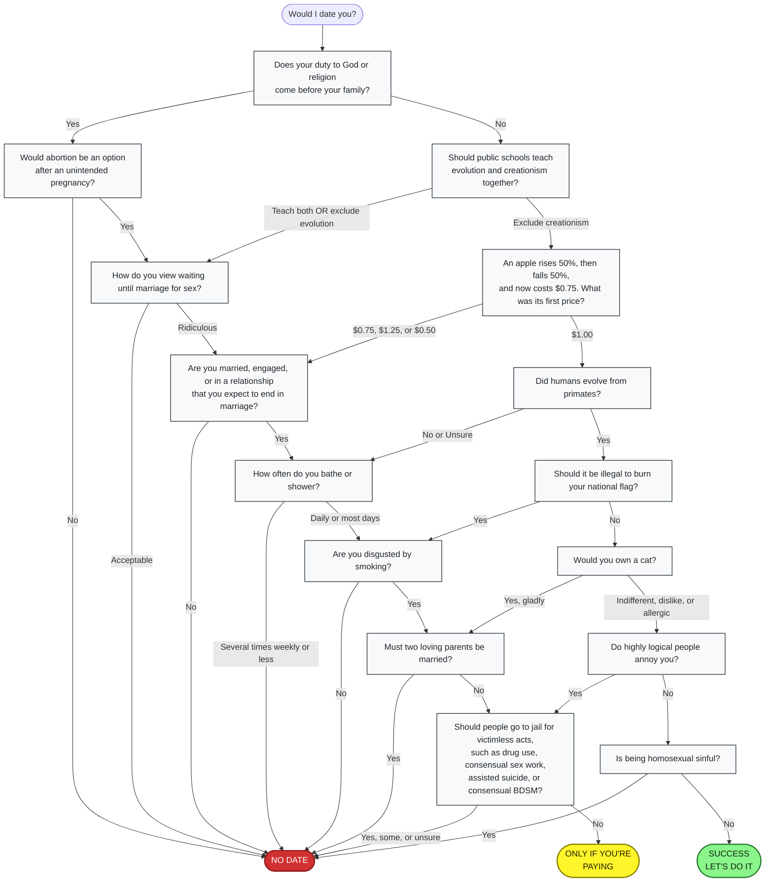

OkCupid describes a tool that converted a user's mandatory match questions into a printable dating flowchart. Each branch represented an accepted or rejected answer.

## Key findings

- Users selected which questions were mandatory.
- Accepted partner answers created explicit branches.
- The result made each user's personal decision rules visible.

## Flowchart reconstruction

The following Mermaid diagram is a paraphrased reconstruction of Chris Coyne's example PDF. It preserves the decision paths but shortens the labels for readability. It represents one user's mandatory filters. It does not represent OkCupid's global question order.

## Algorithm relevance

The flowchart is a direct illustration of asymmetric matching. A user can accept several partner answers even when their own answer is different.

## Sources

- [Chris Coyne's original flowchart PDF](https://web.archive.org/web/20100331172158/http://cdn.okcimg.com/blog/flowchart_to_my_heart/chris.pdf)
- [Archived OkTrends article](https://web.archive.org/web/20100725063756id_/http://blog.okcupid.com/index.php/flowchart-to-my-heart/)
- [Original OkTrends URL](http://blog.okcupid.com/index.php/flowchart-to-my-heart/)
