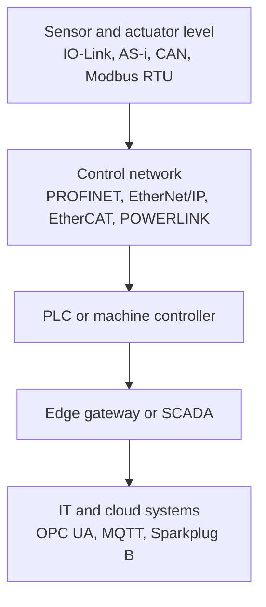

---
title: Industrial Bus Systems in Automation Technology
---
**Industrial bus systems** are communication systems for connecting controllers, drives, sensors, actuators, remote I/O, HMIs, and gateways in automation technology. They differ from ordinary office networking because they must handle cyclic process data, diagnostics, topology constraints, electrical noise, commissioning workflows, and sometimes deterministic timing.

## Mental Model

An automation bus usually answers four questions:

| Question | Typical design choice |
|---|---|
| What is connected? | PLCs, drives, I/O modules, encoders, safety devices, field sensors, gateways |
| How is data exchanged? | Cyclic process image, polling, producer/consumer data, event messages, service requests |
| How predictable must timing be? | Non-real-time, soft real-time, deterministic real-time, motion-control class synchronization |
| How is the network engineered? | Device description files, node addresses, topology rules, terminators, scan lists, controller projects |

## Main Families

| Family | Examples | Main use |
|---|---|---|
| Classic fieldbus | [[CAN bus and CANopen\|CAN bus]], [[CAN bus and CANopen\|CANopen]], DeviceNet, ControlNet, [[PROFIBUS\|PROFIBUS DP]], INTERBUS, CC-Link, AS-Interface, [[Modbus RTU and Modbus TCP\|Modbus RTU]] | Robust field-level wiring, distributed I/O, sensors, actuators, legacy machines |
| Process automation fieldbus | Foundation Fieldbus H1, PROFIBUS PA, HART, WirelessHART | Process instruments, transmitters, valves, hazardous-area installations |
| Industrial Ethernet | [[PROFINET]], [[EtherNet IP\|EtherNet/IP]], [[EtherCAT]], [[Ethernet POWERLINK]], SERCOS III, CC-Link IE, [[Modbus RTU and Modbus TCP\|Modbus TCP]] | Higher bandwidth, controller-to-I/O networks, drives, machine modules, diagnostics |
| Sensor and actuator links | [[IO-Link]], AS-Interface | Low-level connection of simple sensors and actuators to field masters |
| Building automation buses | [[Protocols/Telemetry Protocols/KNX\|KNX]], BACnet MS/TP, BACnet/IP, LonWorks | Building automation, HVAC, lighting, room automation |
| Information and semantic protocols | [[Protocols/OPC UA/OPC UA\|OPC UA]], [[Protocols/Telemetry Protocols/MQTT\|MQTT]], [[Protocols/Telemetry Protocols/Sparkplug B\|Sparkplug B]] | Supervisory systems, edge gateways, telemetry, interoperability, cloud integration |

## Common Systems

| System | Type | Typical role | Strengths | Tradeoffs |
|---|---|---|---|---|
| [[CAN bus and CANopen\|CAN bus]] | Serial fieldbus | Embedded devices, mobile machines, compact machines | Robust differential bus, arbitration, simple controllers, broad ecosystem | Small payloads, limited bandwidth, higher-level behavior depends on profile |
| [[CAN bus and CANopen\|CANopen]] | CAN-based application layer | Drives, I/O modules, sensors | Standardized object dictionary, device profiles, PDO/SDO model | Requires profile knowledge and careful node configuration |
| DeviceNet | CAN-based industrial network | Legacy Rockwell/ODVA field devices | Mature device ecosystem, power and signal on trunk/drop networks | Mostly legacy compared with EtherNet/IP |
| ControlNet | CIP-based fieldbus | Legacy Rockwell cell and controller networks | Scheduled producer/consumer communication, redundancy options | Mostly legacy compared with EtherNet/IP |
| [[PROFIBUS\|PROFIBUS DP]] | Serial fieldbus | PLC-to-remote-I/O and drives | Very common in older European automation systems | Bus timing and termination are sensitive, lower bandwidth than Ethernet |
| [[PROFIBUS\|PROFIBUS PA]] | Process automation fieldbus | Process instruments and valves | Two-wire communication and power for process devices | Usually coupled into PROFIBUS DP or DCS infrastructure |
| Foundation Fieldbus H1 | Process automation fieldbus | DCS-connected transmitters, valves, and process instruments | Device-side function blocks, process diagnostics, two-wire field wiring | Specialized process-automation ecosystem |
| HART | Hybrid analog/digital field communication | Smart process instruments on 4-20 mA loops | Adds parameters and diagnostics to familiar analog loops | Low bandwidth and not a general machine-control bus |
| WirelessHART | Wireless process instrumentation network | Retrofitted or hard-to-wire process measurements | Wireless mesh for process monitoring | Not intended for tight deterministic control loops |
| [[PROFINET]] | Industrial Ethernet | Siemens-centered PLC networks, I/O, drives | Ethernet-based, strong diagnostics, broad device support, real-time classes | Engineering is tightly tied to device descriptions and controller tooling |
| [[EtherNet IP\|EtherNet/IP]] | Industrial Ethernet | Rockwell-centered PLC networks, I/O, drives | CIP object model, producer/consumer I/O, broad North American ecosystem | Network design must account for implicit I/O load and multicast handling |
| [[EtherCAT]] | Industrial Ethernet fieldbus | Fast I/O, synchronized drives, motion control | Very short cycle times, distributed clocks, efficient frame processing | Slave devices need EtherCAT-specific hardware support |
| [[Ethernet POWERLINK]] | Real-time Ethernet | Deterministic machine control and motion | Time-sliced real-time Ethernet, synchronized cyclic communication | Smaller ecosystem than PROFINET, EtherNet/IP, or EtherCAT |
| SERCOS III | Real-time Ethernet | Servo drives and motion systems | Strong motion-control heritage and synchronization | More specialized ecosystem |
| CC-Link | Fieldbus and Industrial Ethernet family | Mitsubishi-centered automation, I/O, drives | Strong Asian automation ecosystem, classic and Ethernet variants | Ecosystem fit matters strongly |
| INTERBUS | Serial fieldbus | Legacy distributed I/O | Efficient ring-like frame through distributed terminals | Legacy; often encountered in installed Phoenix Contact systems |
| CompoNet | Sensor and actuator field network | Machine-level sensors and actuators | Simple field wiring below controller networks | Niche compared with IO-Link and Ethernet-based systems |
| MECHATROLINK | Motion-control network | Servo drives and machine motion | Motion-focused profile family | Specialized ecosystem |
| LonWorks | Control network | Building and infrastructure automation | Distributed control network with large address space | Mostly seen in building automation and legacy systems |
| [[Modbus RTU and Modbus TCP\|Modbus RTU]] | Serial fieldbus protocol | Simple drives, meters, PLC integration | Easy to implement, widely supported, simple register model | No rich semantics, no native discovery, usually polled |
| [[Modbus RTU and Modbus TCP\|Modbus TCP]] | Ethernet protocol | Simple PLC, gateway, and device integration | Same register model over TCP/IP | Not deterministic and still semantically weak |
| [[IO-Link]] | Point-to-point sensor link | Smart sensors and actuators below an I/O master | Simple wiring, device parameters, diagnostics | Not a plant-wide bus; depends on IO-Link masters |
| AS-Interface | Low-level fieldbus | Binary sensors, actuators, simple safety devices | Simple two-wire installation, field-level simplicity | Limited data size and speed |
| P-NET, WorldFIP, RAPIEnet, SafetyNET p, TCnet, EPA, VARAN | Specialized or regional fieldbus and real-time Ethernet systems | Existing plants, regional ecosystems, specialized machine builders | Standardized or historically relevant in specific niches | Usually selected because the installed ecosystem already requires them |

## Classic Fieldbus vs Industrial Ethernet

Classic fieldbuses are usually optimized for simple wiring, deterministic access to a shared medium, and robust field installation. They often need explicit termination, address setting, and vendor-specific device configuration. They are still common in machines with long service lives.

Industrial Ethernet systems use Ethernet physical layers and frames, but they are not all just ordinary TCP/IP traffic. Some systems use standard switched Ethernet with real-time behavior on top. Others, such as EtherCAT and Ethernet POWERLINK, define a stricter communication cycle to reduce jitter and make process data timing predictable.

## Process Automation Fieldbus

Process automation has a different center of gravity than discrete manufacturing. A refinery, chemical plant, water plant, or power plant often cares about long cable runs, hazardous-area installation, device diagnostics, and integration with a distributed control system. That is why Foundation Fieldbus H1, PROFIBUS PA, and HART remain important even though machine builders often talk more about PROFINET, EtherCAT, or EtherNet/IP.

The older 4-20 mA loop is still relevant in this area. HART adds digital device information on top of the analog signal, while Foundation Fieldbus H1 and PROFIBUS PA replace the simple point-to-point loop with a shared digital fieldbus that can also power field instruments.

## Real-Time Categories

| Category | Meaning | Examples |
|---|---|---|
| Non-real-time integration | Timing is useful but not deterministic | [[Protocols/Telemetry Protocols/MQTT\|MQTT]], HTTP APIs, many SCADA connections |
| Soft real-time | Fast enough for many control and I/O tasks, but not hard motion synchronization | [[Modbus RTU and Modbus TCP\|Modbus TCP]], [[EtherNet IP\|EtherNet/IP]], PROFINET RT |
| Deterministic real-time | Communication is scheduled or tightly controlled | [[EtherCAT]], [[Ethernet POWERLINK]], SERCOS III, PROFINET IRT |
| Functional safety over bus | Safety data is transported with extra safety protocol mechanisms | PROFIsafe, CIP Safety, FSoE, openSAFETY |

## Selection Criteria

Choose a bus system by starting with the control problem, not the protocol name.

| Requirement | Good candidates |
|---|---|
| Very simple device integration | [[Modbus RTU and Modbus TCP\|Modbus RTU]], [[Modbus RTU and Modbus TCP\|Modbus TCP]], [[IO-Link]] |
| Existing Siemens PLC ecosystem | [[PROFINET]], [[PROFIBUS\|PROFIBUS DP]], PROFIsafe |
| Existing Rockwell ecosystem | [[EtherNet IP\|EtherNet/IP]], DeviceNet, CIP Safety |
| Process instrumentation or DCS ecosystem | Foundation Fieldbus H1, PROFIBUS PA, HART, WirelessHART |
| High-speed distributed motion | [[EtherCAT]], SERCOS III, [[Ethernet POWERLINK]], PROFINET IRT |
| Embedded or mobile machine network | [[CAN bus and CANopen\|CAN bus]], [[CAN bus and CANopen\|CANopen]], J1939 |
| Sensor-level wiring | [[IO-Link]], AS-Interface |
| Mitsubishi-centered automation ecosystem | CC-Link, CC-Link IE |
| Existing legacy fieldbus installation | PROFIBUS DP, INTERBUS, ControlNet, DeviceNet, Modbus RTU, LonWorks |
| Long machine lifetime and serviceability | The protocol already supported by installed PLCs, drives, and technician tooling |
| Vendor-neutral supervisory integration | [[Protocols/OPC UA/OPC UA\|OPC UA]], [[Protocols/Telemetry Protocols/MQTT\|MQTT]], [[Protocols/Telemetry Protocols/Sparkplug B\|Sparkplug B]] |

## Practical Engineering Notes

- Bus choice is often constrained by the PLC family, drive vendor, machine builder standard, and installed service tooling.
- Device description files matter: GSD/GSDML for PROFIBUS/PROFINET, EDS for CANopen and EtherNet/IP, ESI for EtherCAT, IODD for IO-Link, and DD/EDD or FDI packages for process instruments.
- Termination and topology rules are part of the design, especially for CAN, PROFIBUS, RS-485 based Modbus, and AS-Interface.
- Industrial Ethernet does not automatically mean deterministic control. TCP/IP based protocols and real-time Ethernet profiles have different timing guarantees.
- Gateways are common, but they can hide diagnostics and timing behavior. A gateway is usually best for integration boundaries, not for tight motion loops.
- Safety protocols are separate from normal process data. A network can carry both standard I/O and safety I/O, but the safety layer must be engineered explicitly.

## Relationship To Higher-Level Protocols

Fieldbuses and industrial Ethernet systems usually sit close to the machine. They move process data between controllers and devices. Higher-level protocols such as [[Protocols/OPC UA/OPC UA\|OPC UA]], [[Protocols/Telemetry Protocols/MQTT\|MQTT]], and [[Protocols/Telemetry Protocols/Sparkplug B\|Sparkplug B]] are better suited for supervisory data, semantic models, edge gateways, and cloud-facing telemetry.

This creates a common layered architecture:

## Official Sources

- [CAN in Automation CAN knowledge](https://www.can-cia.org/can-knowledge)
- [B&R POWERLINK](https://www.br-automation.com/en-us/technologies/powerlink/)
- [OPC Foundation introduction to Ethernet POWERLINK](https://reference.opcfoundation.org/specs/OPC-30110/4.1)
- [PROFINET specification downloads](https://www.profibus.com/download/profinet-specification)
- [EtherCAT Technology Group technology overview](https://www.ethercat.org/en/technology.html)
- [Fieldbus overview on Wikipedia](https://en.wikipedia.org/wiki/Fieldbus)
