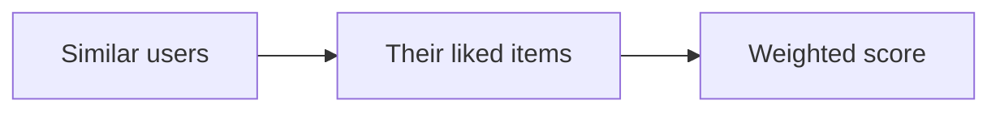

---
title: Neighborhood Collaborative Filtering
source: Practical Recommender Systems
source_chapter: 8
---
**Neighborhood collaborative filtering** recommends from similar users or similar items. It uses behavior patterns, not item metadata.

## User-user collaborative filtering

User-user filtering finds users similar to the active user and recommends items those neighbors liked.



It is intuitive but can be expensive because user populations change often.

## Item-item collaborative filtering

Item-item filtering finds items similar to items the active user liked.


This is often more stable because item catalogs change slower than user behavior. Item similarity can be precomputed offline.

## C# example: item-item recommendation

```csharp
public readonly record struct SimilarItem(string ItemId, double Similarity);

static IReadOnlyList<string> RecommendFromSimilarItems(
    IReadOnlyDictionary<string, double> userRatings,
    IReadOnlyDictionary<string, List<SimilarItem>> itemSimilarities,
    int count)
{
    var scores = new Dictionary<string, double>();
    var weights = new Dictionary<string, double>();

    foreach (var (ratedItem, rating) in userRatings)
    {
        if (!itemSimilarities.TryGetValue(ratedItem, out var neighbors))
        {
            continue;
        }

        foreach (var neighbor in neighbors)
        {
            if (userRatings.ContainsKey(neighbor.ItemId))
            {
                continue;
            }

            scores[neighbor.ItemId] = scores.GetValueOrDefault(neighbor.ItemId)
                + (neighbor.Similarity * rating);
            weights[neighbor.ItemId] = weights.GetValueOrDefault(neighbor.ItemId)
                + Math.Abs(neighbor.Similarity);
        }
    }

    return scores
        .Where(x => weights[x.Key] > 0)
        .Select(x => new
        {
            ItemId = x.Key,
            Score = x.Value / weights[x.Key]
        })
        .OrderByDescending(x => x.Score)
        .Take(count)
        .Select(x => x.ItemId)
        .ToList();
}
```

## Rust example: item-item recommendation

```rust
use std::collections::HashMap;

fn recommend_from_similar_items(
    user_ratings: &HashMap<String, f64>,
    similarities: &HashMap<String, Vec<(String, f64)>>,
    count: usize,
) -> Vec<(String, f64)>
{
    let mut weighted_scores = HashMap::<String, f64>::new();
    let mut weight_totals = HashMap::<String, f64>::new();

    for (rated_item, rating) in user_ratings
    {
        let Some(neighbors) = similarities.get(rated_item) else
        {
            continue;
        };

        for (candidate, similarity) in neighbors
        {
            if !user_ratings.contains_key(candidate)
            {
                *weighted_scores.entry(candidate.clone()).or_default() += similarity * rating;
                *weight_totals.entry(candidate.clone()).or_default() += similarity.abs();
            }
        }
    }

    let mut predictions = weighted_scores.into_iter()
        .filter_map(|(item, score)|
        {
            let weight = weight_totals[&item];
            (weight > 0.0).then_some((item, score / weight))
        })
        .collect::<Vec<_>>();

    predictions.sort_by(|a, b| b.1.total_cmp(&a.1));
    predictions.truncate(count);
    predictions
}
```

## Practical levers

- similarity function
- minimum overlap between users or items
- number of neighbors
- rating normalization
- recency weighting
- whether to include negative similarity

## Pros and cons

Neighborhood methods are explainable and easy to prototype. They suffer when data is sparse, when users have unusual tastes, or when new items have little interaction history.

## Related algorithms

- [[Similarity Measures]]
- [[Association Rule Recommendations]]
- [[Matrix Factorization]]
- [[Cold Start Strategies]]

## Source

- Kim Falk, *Practical Recommender Systems*, chapter 8.
