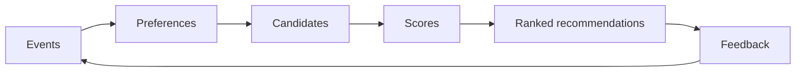

---
title: Recommender Systems
aliases:
  - Recommendation Systems
source: Practical Recommender Systems
author: Kim Falk
publisher: Manning Publications
year: 2019
---
A **recommender system** selects and ranks items that are likely to be useful for a user in a specific context. The important work is not only the algorithm. A practical system needs event collection, rating interpretation, candidate generation, ranking, evaluation, monitoring, and product constraints.

## Core pipeline

| Stage                | Purpose                                                                                |
| -------------------- | -------------------------------------------------------------------------------------- |
| Event collection     | Capture views, clicks, ratings, purchases, dwell time, saves, skips, and impressions.  |
| Preference modeling  | Convert explicit and implicit behavior into user-item signals.                         |
| Candidate generation | Produce a manageable set of possible recommendations.                                  |
| Scoring              | Estimate relevance, rating, probability of click, probability of purchase, or utility. |
| Ranking              | Order the candidates and apply business, diversity, freshness, and safety rules.       |
| Evaluation           | Measure offline quality and online business impact.                                    |
| Feedback loop        | Feed new behavior back into models and monitoring.                                     |

## Important algorithms and ideas

| Article                                             | What it covers                                                                      |
| --------------------------------------------------- | ----------------------------------------------------------------------------------- |
| [[User-Item Matrix and Ratings]]                    | Explicit ratings, implicit ratings, sparsity, confidence, and time decay.           |
| [[Popularity and Non-personalized Recommendations]] | Charts, recency, editorial picks, and fallback recommenders.                        |
| [[Association Rule Recommendations]]                | Co-occurrence rules such as "users who bought X also bought Y".                     |
| [[Similarity Measures]]                             | Jaccard, Manhattan, Euclidean, cosine, and Pearson similarity.                      |
| [[K-means Clustering]]                              | Group users or items into coarse taste segments.                                    |
| [[Neighborhood Collaborative Filtering]]            | User-user and item-item collaborative filtering.                                    |
| [[Content-based Filtering]]                         | Item profiles, feature extraction, TF-IDF, and user profiles.                       |
| [[TF-IDF for Content-based Recommendation]]        | Weight terms by local frequency and catalog rarity.                                 |
| [[Latent Dirichlet Allocation for Recommendation]] | Extract topic distributions from item text.                                         |
| [[Matrix Factorization]]                            | Latent factors, SVD-style decomposition, biases, and gradient descent.              |
| [[Singular Value Decomposition Recommenders]]      | Reduce a rating matrix to a smaller latent factor space.                            |
| [[Funk SVD]]                                        | Learn latent factors directly from observed ratings.                                |
| [[Hybrid Recommenders]]                             | Switching, mixed, weighted, monolithic, and stacked recommenders.                   |
| [[Feature-weighted Linear Stacking]]                | Change ensemble weights from user and item meta-features.                           |
| [[Ranking and Learning to Rank]]                    | Pointwise, pairwise, listwise ranking, and Bayesian Personalized Ranking.           |
| [[Bayesian Personalized Ranking]]                   | Learn pairwise rankings from positive and unobserved interactions.                  |
| [[Cold Start Strategies]]                           | New users, new items, gray sheep, onboarding, and fallbacks.                        |
| [[Evaluating Recommender Systems]]                  | Prediction error, ranking metrics, coverage, diversity, serendipity, and A/B tests. |

## Practical design rule

Use multiple recommenders. A production system usually combines simple fallbacks, content-based methods, collaborative signals, and a ranker. The best algorithm depends on available data, latency, explainability, business goals, and how quickly the catalog and users change.

Each algorithm article includes a Rust example that uses the standard library.

## Source

- Kim Falk, *Practical Recommender Systems*, Manning Publications, 2019.
