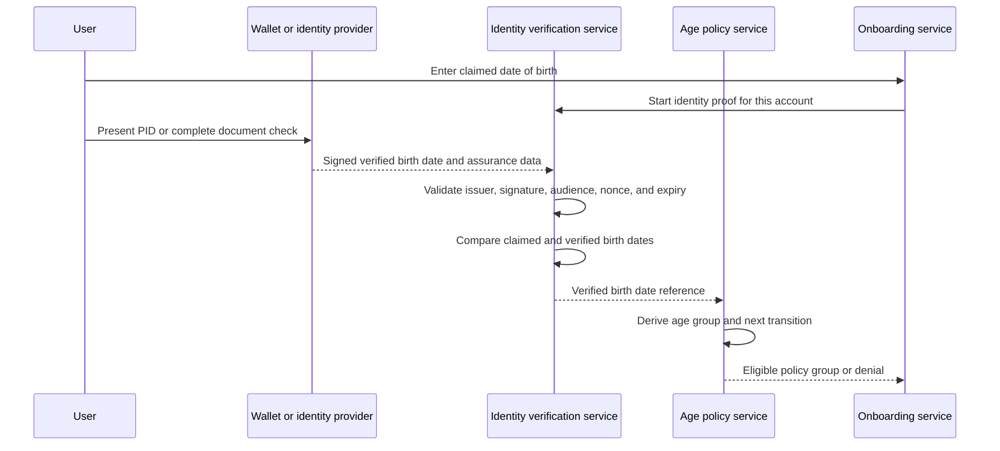
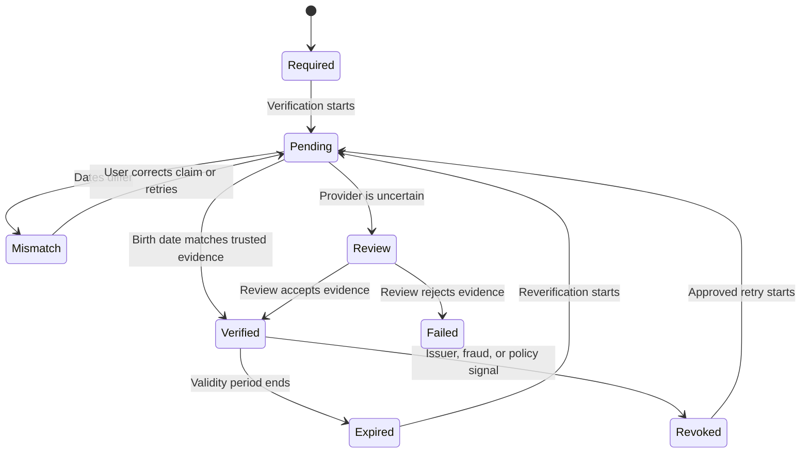

**Dating site age assurance** verifies the user's exact date of birth and applies the correct age policy throughout the account life cycle. This design supports approved users below 18. It does not use one `AgeOver18` flag for all users.

Age assurance is part of [[Dating Site Identity Verification]]. The identity process verifies the date of birth. The age service derives the current age and policy group from that verified value.

## Required result

The user enters a date of birth during onboarding. A trusted credential or identity provider must return the same complete date.

An exact match is required. If the dates differ, do not silently replace the user's value. Stop activation and let the user correct a typing error or request a reviewed retry.

## Sources of a verified birth date

Use the following methods in order of preference:

1. A European Digital Identity Wallet Person Identification Data (**PID**) presentation that contains `birth_date`.
2. A qualified or approved national electronic identity presentation.
3. A specialist identity provider that validates a passport or national identity card and returns the verified date.
4. A reviewed, accessible alternative for a person who cannot use the supported credential or document flow.

The EU age-verification solution returns an age-threshold result. This is useful for an adult-only gate, but it is not sufficient when the service must verify an exact date and safely move a user between minor policy groups. Use an EUDI PID or an approved identity-proofing result for this requirement.

## Data model

The exact date of birth can be necessary to calculate policy changes and stop a user from changing age. Store it only in the restricted identity vault described in [[Dating Site GDPR Compliance]].

| Field | Purpose |
| --- | --- |
| `UserId` | Internal account identifier |
| `ClaimedBirthDate` | Value entered by the user during the current verification attempt |
| `VerifiedBirthDate` | Exact provider-verified date, encrypted in the identity vault |
| `MatchResult` | Exact match, mismatch, or review required |
| `AssuranceMethod` | PID, national eID, document provider, or approved alternative |
| `IssuerId` | Trusted issuer or provider identifier |
| `ProviderTransactionId` | Restricted audit and support reference |
| `VerifiedAt` | Successful verification time |
| `ValidUntil` | Reverification deadline, if applicable |
| `PolicyVersion` | Rules used for the decision |

Publish only derived values to other services:

| Derived value | Use |
| --- | --- |
| `AgeInYears` | Display and permitted preference checks |
| `AgePolicyGroup` | Minor cohort, adult, or unsupported |
| `NextPolicyTransitionAt` | Exact time when access rules must be recalculated |
| `AgeVerificationState` | Verified, expired, revoked, or review required |

Do not put the exact date of birth in access tokens, search indexes, analytics events, advertisements, logs, or the public profile. The public profile can show the current age.

Delete `ClaimedBirthDate` after a successful comparison because `VerifiedBirthDate` becomes the authoritative value. Retain the claim only while a mismatch review or appeal needs it.

## Policy groups

Age rules are country-specific policy data. A possible structure is:

| Group | Example meaning | Required behavior |
| --- | --- | --- |
| `UnsupportedChild` | Below the approved minimum for that country | Do not activate a dating profile |
| `MinorCohortA` | Approved younger minor group | Strict minor-only discovery and narrow age range |
| `MinorCohortB` | Approved older minor group | Strict minor-only discovery and country-specific age range |
| `Adult` | At or above the national adult threshold | Adult-only discovery |

The example groups are not legal thresholds. Maintain a launch matrix for every supported country. It must define the minimum access age, minor cohorts, permitted age gaps, consent rules, identity methods, retention rules, and transition behavior. Article 8 of the GDPR concerns a child's consent for some information-society processing. It is not a general permission to operate a dating service for that child.

## Boundary transitions

Calculate age from the verified date, an authoritative clock, and the policy timezone. Schedule `NextPolicyTransitionAt`; also run a daily repair job.

When a user moves from one minor group to another, re-evaluate discovery, matches, and conversations before the new rules take effect. When a user becomes an adult:

1. Remove the user from all minor candidate indexes.
2. Stop minor conversations before adult discovery becomes available.
3. Re-evaluate existing matches under the transition policy.
4. Require any new adult consent and policy notice.
5. Activate adult discovery only after all transition steps succeed.

Never let an existing match bypass an age boundary.

## Life cycle

Reverify after a high-risk account recovery, a relevant credential revocation, a material identity conflict, or a policy-defined validity period. Do not ask for a new passport scan only because the user had a birthday.

## Security controls

- Bind each presentation to the site, account, current session, and a one-time nonce.
- Validate the credential format, issuer, signature, trust list, expiry, status, and requested attributes.
- Accept each challenge and provider event only once.
- Verify provider callbacks and process them idempotently.
- Do not let support staff edit the verified date directly.
- Keep source documents, face images, and biometric templates out of the dating-site systems.
- Put uncertain results into a restricted review queue.
- Record every read of the exact birth date.
- Test leap days, timezones, clock changes, expired credentials, replay, account recovery, and every policy-group transition.

## Sources

- [Commission Implementing Regulation EU 2024/2977: PID attributes](https://eur-lex.europa.eu/legal-content/EN/TXT/?uri=CELEX%3A32024R2977)
- [European Digital Identity Wallet](https://digital-strategy.ec.europa.eu/en/factpages/european-digital-identity-wallet)
- [European Commission: EU Age Verification Solution](https://digital-strategy.ec.europa.eu/en/faqs/eu-age-verification-solution)
- [EDPB Statement 1/2025 on Age Assurance](https://www.edpb.europa.eu/documents/statement/statement-12025-on-age-assurance_en)
- [GDPR Article 8](https://eur-lex.europa.eu/legal-content/EN/TXT/?uri=CELEX%3A32016R0679)
- [[Dating Site Identity Verification]]
- [[Dating Site Minor Safety]]
- [[Dating Site Onboarding]]
