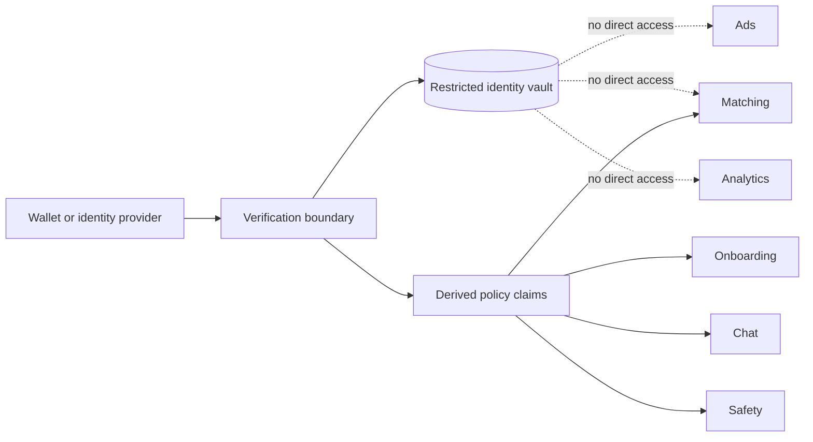

**Dating site GDPR compliance** must be part of the system design. This product processes identity data, location signals, private messages, data about minors, and dating attributes that can reveal sexual orientation or sex life. Some identity flows can also process biometric data.

This note is an architecture checklist. It is not legal advice. A data-protection officer or qualified EU counsel must approve the processing purposes, lawful bases, Article 9 conditions, country launch rules, processor contracts, and retention schedule before a pilot.

## Required assessment

Complete a Data Protection Impact Assessment (**DPIA**) before the pilot. The combined processing is likely to create high risk because it includes vulnerable users, systematic fraud and safety monitoring, special-category dating data, location signals, and possible biometric verification.

Create a processing record for each purpose:

| Purpose | Example data | Decision that must be documented |
| --- | --- | --- |
| Account authentication | OIDC subject, passkey public key, session and device data | Article 6 basis, recovery, retention, and security |
| Email and phone verification | Contact values and challenge records | Necessity, reuse prevention, retention, and processors |
| Identity proof | Legal name, birth date, nationality, provider result | Article 6 basis, necessity, alternatives, and access |
| Biometric holder check | Provider-side face match and liveness result | Article 6 basis, Article 9 condition, strict necessity, and non-biometric alternative |
| Minor safety | Age group, reports, risk and message signals | Basis, transparency, human review, retention, and safeguards |
| Matching | Profile preferences and question answers | Article 6 basis and a separate Article 9 condition where required |
| Location plausibility | IP-derived country, optional device country, and mismatch signals | Basis, necessity, permission, accuracy, retention, and user review |
| Advertising | Context, consent state, age group, and entitlement | DSA minor restrictions, GDPR/ePrivacy rules, recipients, and consent where required |
| Payments | Provider customer and transaction references | Contract and legal obligations, retention, and PSP roles |

Do not select a lawful basis only because it is convenient. Consent must be specific, informed, freely given, and as easy to withdraw as to give. If biometric verification is mandatory and there is no real alternative, explicit consent can be unsuitable. Legal review must select a valid Article 9 condition before biometric processing starts.

## Data protection by design

Apply the GDPR principles of purpose limitation, data minimization, accuracy, storage limitation, security, and accountability.

The identity vault must:

- use a separate database or tightly isolated schema and service identity;
- encrypt sensitive fields with envelope encryption and managed keys;
- permit access only through narrow commands;
- record every read and change;
- exclude values from logs, traces, caches, search, advertisements, and general analytics;
- expose derived age and claim states instead of raw identity values;
- support independent deletion and retention workflows.

Store a legal name privately. Let the user choose a public display name. Store the exact birth date only when the documented minor-safety and policy-transition need cannot be met with less data.

## Biometric boundary

A selfie-to-document face match or liveness check can process biometric data for unique identification. Keep this work at a selected identity provider when possible.

- Upload images directly from the client to the provider.
- Do not copy passport images, selfies, video, or biometric templates into application storage.
- Accept a signed result with only the required claims and assurance data.
- Require the provider to delete source material after the approved short period.
- Verify deletion behavior and subprocessor retention by contract and audit.
- Provide an accessible reviewed alternative where required.
- Do not reuse identity biometrics for profile-photo ranking, emotion analysis, advertising, or general surveillance.

## EU and EEA processing

An EU-only deployment reduces transfer risk but does not remove GDPR duties.

- Select EU or EEA regions for databases, object storage, backups, logs, support tools, and identity processing.
- Sign Article 28 data-processing agreements with processors.
- Review every subprocessor and remote-support location.
- Block or assess transfers outside the EEA. Apply the approved transfer mechanism when a transfer is necessary.
- Define controller, joint-controller, and processor roles for every provider.
- Test data export, correction, restriction, objection, and deletion across all services and backups.

## Retention

Create a field-level retention schedule before collection. A practical direction is:

| Data | Retention direction |
| --- | --- |
| Provider passport, identity-card, selfie, and liveness source data | Do not receive it; require prompt provider deletion |
| Verified legal name and birth date | While the active account needs them; then delete or retain only under a documented legal or safety hold |
| Verified nationality or residence | Refresh and delete when no longer required |
| Raw IP address | Short security period only, unless a documented incident requires a hold |
| IP-derived country observation | Short fraud window with provider version and confidence |
| Device coordinates | Prefer on-device country derivation; otherwise process briefly and delete after country derivation |
| Device-country observation | Short fraud window with method, coarse accuracy, and observation time |
| Verification transaction reference | Minimum audit, appeal, and fraud period |
| Failed attempts | Short risk and support period |
| Safety evidence | Policy-specific period based on severity, appeal, and legal duty |

Do not keep data indefinitely for possible future fraud analysis. A legal or safety hold must name its reason, owner, scope, and review date.

## User rights and transparency

- Explain each claim, evidence source, purpose, recipient, and retention period in clear language.
- Let the user see and correct declared data without changing verified data silently.
- Provide human review for material automated restrictions and identity mismatches.
- Keep a record of consent text, version, action, and withdrawal where consent is used.
- Protect data export, correction, and deletion with recent or step-up authentication.
- Do not expose another account while resolving a duplicate identity, email, or phone number.
- Give minors information that they can understand.

## Governance checklist

- Approve the DPIA and residual risk before launch.
- Decide whether a data-protection officer is mandatory and appoint one when required.
- Maintain records of processing activities.
- Complete legitimate-interest assessments when that basis is proposed.
- Define a personal-data breach response and notification process.
- Audit staff access and provider access.
- Reassess the DPIA for new countries, age groups, biometric methods, message analysis, advertising, or automated decisions.

## Sources

- [General Data Protection Regulation](https://eur-lex.europa.eu/legal-content/EN/TXT/?uri=CELEX%3A32016R0679)
- [EDPB: Data protection basics](https://www.edpb.europa.eu/sme/learn-the-basics/data-protection-basics_en)
- [EDPB: Endorsed DPIA guidelines](https://www.edpb.europa.eu/endorsed-wp29-guidelines_en)
- [EDPS: Special categories of personal data](https://www.edps.europa.eu/data-protection/data-protection/glossary/s_en)
- [EDPS: Digital Identity Wallet](https://www.edps.europa.eu/data-protection/technology-monitoring/techsonar/digital-identity-wallet)
- [[Dating Site Identity Verification]]
- [[Dating Site Minor Safety]]
- [[Dating Site Trust and Safety]]
