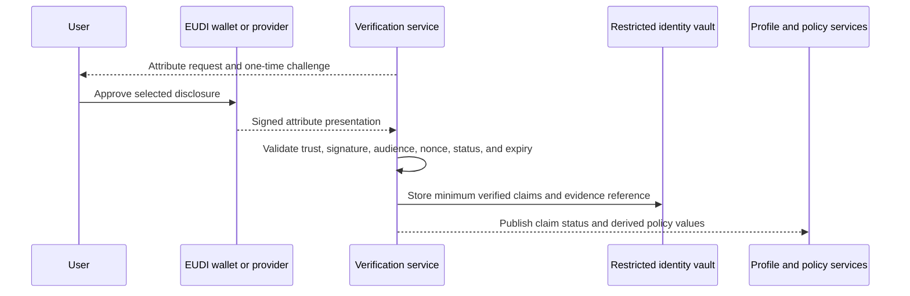

**Dating site identity verification** checks specific claims about a person. It is separate from login authentication. A passkey proves control of an account credential. It does not prove a legal name, birth date, nationality, residence, or that all later activity is human-made.

## Claims and evidence

Do not combine different claims into one `Verified` flag.

| Claim | Preferred evidence | Result | Important limit |
| --- | --- | --- | --- |
| Exact date of birth | EUDI PID `birth_date` or verified identity document | Exact verified date | Must match the value entered by the user |
| Legal name | EUDI PID `given_name` and `family_name` or verified identity document | Verified legal name | Keep private unless the user explicitly chooses disclosure |
| Nationality | EUDI PID `nationality` or passport | One or more verified nationalities | Nationality is not residence or current location |
| Residence country | EUDI PID `resident_country` or approved residence evidence | Verified residence claim with issue time | The attribute can be absent and can become outdated |
| Current connection country | IP geolocation at a defined confidence level | Plausibility signal | VPNs, roaming, relays, carriers, and corporate networks can change the result |
| Current device country | Optional device location with explicit permission | Stronger plausibility signal | GPS can be spoofed and proves presence only at one time |
| Document holder | Provider-side face match and liveness check, where lawful | Holder-binding result | Biometric processing needs strict necessity and an alternative path |
| Human presence now | WebAuthn user presence, liveness challenge, or risk-based challenge | Session or event signal | Does not prove that future text or images are not generated by AI |
| One person per account | Platform-scoped identity binding plus reviewed duplicate signals | Duplicate risk | Do not create a reusable cross-service identity number |

The public product can show separate labels such as `Identity verified` and `Residence country plausible`. Do not show the legal name, date of birth, nationality, document type, or verification method by default.

## Preferred EU flow

The EUDI PID data set has mandatory attributes for family name, given name, birth date, birth place, and nationality. It can also contain residence attributes. Request only the attributes required for the current purpose.

Use pairwise or platform-scoped identifiers when the credential supports them. Do not store a passport number, national identifier, full credential, or wallet presentation unless a documented necessity test requires it.

## Document-provider fallback

If a suitable wallet is not available:

1. The verification service creates a one-time provider session bound to the account.
2. The client sends document, selfie, and liveness data directly to the provider.
3. The provider checks document authenticity, extracts the required claims, checks holder binding, and returns a signed result.
4. The site validates the callback and stores only verified claims, result codes, provider reference, assurance level, and times.
5. The provider deletes source documents and biometric data under the shortest approved retention period.

Select an EU or EEA processor with a data-processing agreement, documented subprocessors, tested deletion, and no unapproved transfer. Provide a non-biometric reviewed path when biometric processing is not necessary or a user cannot complete it.

## Residence and location plausibility

Keep three independent values:

- `Nationality`: a legal relationship with a country.
- `ResidentCountry`: the verified or declared usual country of residence.
- `ConnectionCountry`: the country inferred from the current network address.
- `DeviceCountry`: the country derived from an optional current device location.

IP geolocation and device location are useful only as fraud and plausibility signals. They cannot establish residence.

| Comparison | Default action |
| --- | --- |
| Connection country equals verified residence country | Add a weak positive signal |
| Connection country equals declared but unverified residence country | Keep the claim unverified; add a weak positive signal |
| Connection country differs | Record a risk signal; explain that VPN or travel can cause it; use step-up verification only when risk justifies it |
| IP location is unknown or low confidence | Do not infer a country |
| Repeated rapid country changes | Add a network-risk signal and evaluate account compromise or automation |
| Device country equals verified residence and connection country | Add a stronger positive signal for current presence, not residence proof |
| Device country differs from the other values | Explain travel and GPS limitations; use review or step-up only when the total risk justifies it |

Perform the lookup at the edge or backend. Send only the derived country, provider version, confidence class, and observation time to the risk service. Do not expose the IP address to matching, advertising, or normal analytics. Retain raw addresses only for a documented security period. IP addresses and location data are personal data under EU data-protection guidance.

Request device location only with explicit operating-system or browser permission and only for a defined onboarding or risk purpose. Prefer converting coordinates to a country on the device. If the server must do the conversion, keep the coordinates in a short-lived verification boundary and delete them after the result is produced. Store only `DeviceCountry`, a coarse accuracy class, observation time, method, and result. Do not take GPS data from profile-photo EXIF metadata.

Never block solely because a network or device country differs. The user can travel, use a VPN, use mobile roaming, access the service through an employer network, deny location permission, or use a device with poor location accuracy. GPS can also be spoofed. Give the user a correction or review path and a verification method that does not require location permission.

## Human and automation assurance

There is no reliable test that proves a remote account is always controlled by a human or never uses AI. Use several independent controls:

1. Bind the account to a verified person and a passkey.
2. Require WebAuthn user verification for sensitive or high-risk actions.
3. Use provider-side liveness only during identity proofing or a justified step-up check.
4. Rate-limit registration, profile changes, likes, messages, and media uploads.
5. Detect repeated text, coordinated devices, impossible activity rates, scripted navigation, and many accounts that share infrastructure.
6. Use a risk-based challenge or manual review. Do not challenge all users continuously.
7. Apply periodic step-up checks to high-risk accounts.
8. Treat image provenance and [[C2PA Content Credentials]] as signals. Absence of provenance is not proof of AI generation.

A real person can operate a content farm or use an AI assistant. Therefore, enforce behavior policy even when identity and liveness checks pass.

## Verification state

Store each verified claim independently:

| Field | Purpose |
| --- | --- |
| `ClaimType` | Birth date, legal name, nationality, residence country, or holder binding |
| `ClaimValueEncrypted` | Restricted value when storage is necessary |
| `ValueHash` | Platform-scoped equality or duplicate check where justified |
| `VerificationState` | Verified, expired, revoked, mismatch, or review required |
| `IssuerId` | Issuer or provider |
| `AssuranceMethod` | PID, eID, document, residence evidence, or fallback |
| `VerifiedAt` | Verification time |
| `ValidUntil` | Validity or review deadline |
| `EvidenceReference` | Provider reference, not the raw document |
| `PolicyVersion` | Decision rules |

Residence and network plausibility can change more often than legal name or date of birth. Give each claim its own validity and refresh policy.

## Sources

- [Regulation EU 2024/1183: European Digital Identity Framework](https://eur-lex.europa.eu/eli/reg/2024/1183/oj?locale=en)
- [Commission Implementing Regulation EU 2024/2977: PID attributes](https://eur-lex.europa.eu/legal-content/EN/TXT/?uri=CELEX%3A32024R2977)
- [European Digital Identity Wallet](https://digital-strategy.ec.europa.eu/en/factpages/european-digital-identity-wallet)
- [EDPB: What is personal data?](https://www.edpb.europa.eu/node/5284_en)
- [CJEU C-582/14: Dynamic IP addresses and personal data](https://eur-lex.europa.eu/legal-content/EN/TXT/?uri=CELEX%3A62014CJ0582)
- [[Dating Site Age Assurance]]
- [[Dating Site GDPR Compliance]]
- [[Dating Site Identity and Access]]
