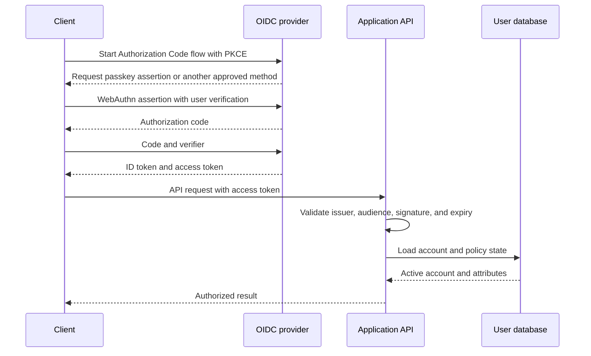
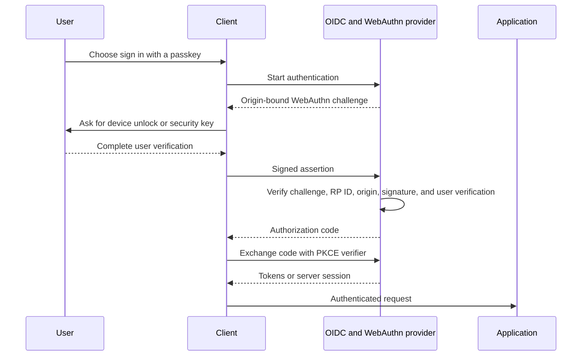
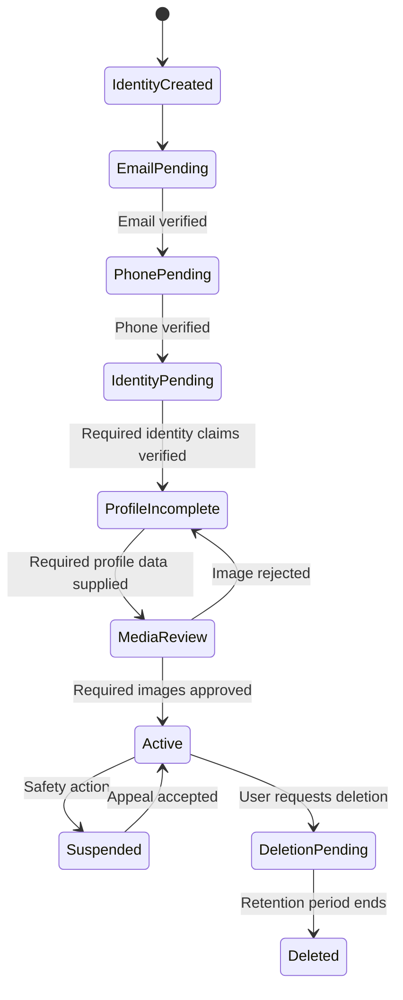

**Dating site identity and access** separates proof of identity from product data and relationship-based permissions. Authentication answers who the caller is. Authorization decides what that caller can do now.

## Boundary

Use an OpenID Connect (**OIDC**) provider for login, passkeys, password recovery, social login, multifactor authentication, session revocation, and token issue. Keycloak is one self-hosted option. Passkeys are a primary authentication method, not an optional identity-proofing feature. Store dating profile data and onboarding progress in the application, not in identity-provider claims.

[[Dating Site Onboarding]] requires verified control of both an email address and a phone number before account activation. [[Dating Site Identity Verification]] then verifies required identity claims, including the exact date of birth. Contact checks and passkeys do not prove the user's legal identity or age.

## Account model

Keep these records separate:

| Record | Key fields | Purpose |
| --- | --- | --- |
| `IdentityLink` | `UserId`, `Issuer`, `Subject` | Maps an external login identity to one application user |
| `UserAccount` | `UserId`, `Status`, `CreatedAt`, `DeletedAt` | Stable application identity and life-cycle state |
| `UserProfile` | `UserId`, profile fields, visibility state | Dating data shown or used for discovery |
| `ConsentRecord` | `UserId`, document version, decision, time | Evidence for terms, privacy, and optional processing |
| `DeviceSession` | Session ID, user, device, expiry, revocation state | Supports device lists and selective logout |
| `ContactPoint` | User ID, type, normalized value, verification and change times | Verified email and phone state |
| `PasskeySummary` | User ID, credential reference, name, created time, last-used time, backup state | User-visible passkey management; the OIDC provider owns cryptographic data |

Do not use an email address as the primary key. It can change. The OIDC pair `(issuer, subject)` identifies the login account. An internal opaque `UserId` identifies application data.

## Passkeys

Implement passkeys with WebAuthn through the OIDC provider. Prefer discoverable credentials so that a user can sign in without entering a username. Require user verification for sign-in and sensitive actions.

The provider must:

- bind credentials to the exact production Relying Party ID and approved origins;
- use a random opaque user handle, not an email address, legal name, or date of birth;
- require HTTPS and validate the origin, challenge, signature, credential ID, and user-verification result;
- support several passkeys per account and let the user name and remove them;
- protect registration of an additional passkey with recent strong authentication;
- notify the user when a passkey is added or removed;
- avoid device-identifying attestation unless a documented security requirement justifies it;
- record a safe audit event without biometric data.

A platform authenticator can use a fingerprint, face, or device PIN. The dating site does not receive the fingerprint or face data. It receives a signed WebAuthn result from the authenticator through the OIDC provider.

Support both synchronized passkeys and hardware or device-bound passkeys. Encourage two independent recovery methods, such as a second passkey on another device and single-use recovery codes. Do not make SMS the only recovery path.

Account recovery must not make passkeys ineffective. For a high-risk recovery, verify more than one existing channel, apply risk checks, and require identity step-up when needed. Add a cooling period before email, phone, passkey, data export, or payment changes. Revoke existing sessions and notify all verified channels after a successful recovery.

A passkey proves control of a credential and a user-presence or user-verification event. It does not prove the person's legal name, date of birth, residence, or that later content was made without AI.

## Token policy

- Use the Authorization Code flow with Proof Key for Code Exchange (**PKCE**) for web and mobile clients.
- Use short-lived, audience-restricted access tokens.
- Rotate refresh tokens, detect replay, and revoke a token family after replay.
- Keep tokens out of URLs and logs.
- For a browser, prefer a secure, `HttpOnly`, `SameSite` session cookie through a backend-for-frontend when the deployment permits it.
- Do not put changing data such as block lists, subscription state, or profile completeness in long-lived tokens.

## Authorization model

Role-based access control is sufficient for staff roles. User actions need attribute-based and relationship-based rules.

| Action | Required rules |
| --- | --- |
| Read a public profile projection | Caller is active; target is discoverable; neither user blocked the other; policy filters pass |
| Edit a profile | Caller owns the profile; account is active |
| View an original image | Deny to normal clients; allow only the owner or approved moderation workflow |
| Send a message | Active mutual match; no block; conversation is active; rate limit passes |
| Moderate content | Staff role plus assigned policy scope; action is audited |
| Export or delete data | Step-up authentication; request belongs to the caller; workflow state allows the action |

The default result is deny. Check permission on each request. Do not depend only on a check in the user interface.

## Registration workflow

Registration spans several domains. Use an idempotent workflow instead of one distributed transaction.

Publish state-change events such as `UserActivated`, `UserSuspended`, and `UserDeletionRequested`. Search, matching, media, and chat consumers remove access promptly. Each consumer records the last processed event ID.

## Abuse controls

- Rate-limit registration, login, recovery, verification, and token refresh by account, device, IP range, and risk signal.
- Add bot and credential-stuffing detection.
- Prefer passkey authentication and require WebAuthn user verification for high-risk actions.
- Require step-up authentication for email change, account recovery, data export, and deletion.
- Keep security audit events in append-only storage with restricted access.
- Never reveal whether a specific account exists during password recovery.
- Apply age and regional eligibility rules before profile activation.
- Rate-limit email and phone verification sends and checks by account, destination, IP range, and device.
- Do not use phone possession by itself as strong identity proof or as the only recovery method.

## Sources

- [ByteByteGo: Token, Cookie, Session](https://bytebytego.com/guides/token-cookie-session/)
- [ByteByteGo: Design A Rate Limiter](https://bytebytego.com/courses/system-design-interview/design-a-rate-limiter)
- [OpenID Connect Core 1.0](https://openid.net/specs/openid-connect-core-1_0-18.html)
- [RFC 9700: OAuth 2.0 Security Best Current Practice](https://www.rfc-editor.org/rfc/rfc9700.html)
- [W3C Web Authentication Level 3](https://www.w3.org/TR/webauthn-3/)
- [FIDO Alliance: Passkeys](https://fidoalliance.org/passkeys/)
- [OWASP Authorization Cheat Sheet](https://cheatsheetseries.owasp.org/cheatsheets/Authorization_Cheat_Sheet.html)
- [[Dating Site Identity Verification]]
