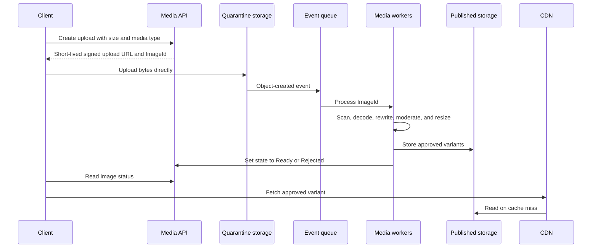
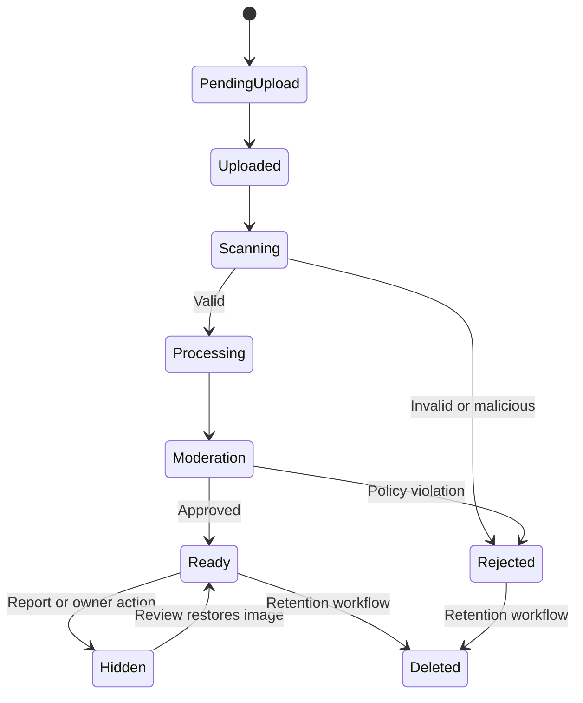

**Dating site image management** stores private source files, validates uploads, creates safe display variants, runs moderation, and publishes approved images through a content delivery network (**CDN**).

Image bytes belong in object storage. Image metadata and workflow state belong in a database.

Do not compare a profile image with an identity-document portrait inside the media service. If holder binding is necessary and lawful, an approved identity provider performs the face match and returns only a result. Profile-photo face matching can be biometric processing and requires the controls in [[Dating Site GDPR Compliance]].

## Upload flow

The client never chooses the storage key. The API creates an opaque `ImageId` and a storage key. The signed upload URL limits object key, byte size, media type, and expiry where the storage provider supports these conditions.

## State model

Every state change is idempotent. A worker can retry after a crash. Use a content hash to detect repeated processing and possible duplicate abuse, but do not use that hash as the public identifier.

## Validation and transformation

Run all parsers in an isolated worker with CPU, memory, file-size, pixel-count, and time limits.

1. Check the uploaded byte count and quota.
2. Detect the format from the bytes. Do not trust the file name or `Content-Type` header.
3. Decode the complete image with a maintained image library.
4. Reject unsupported formats, invalid dimensions, extreme pixel counts, and decompression bombs.
5. Scan for known malicious content.
6. Correct orientation before metadata removal.
7. Rewrite the decoded pixels to a new safe file.
8. Remove EXIF, GPS, thumbnails, comments, and other metadata from public variants.
9. Create fixed variants such as thumbnail, card, full-screen, and moderation preview.
10. Run automated moderation. Send uncertain or reported content to human review.

Keep an original only if the product has a defined need. Store it in a private bucket with a short retention rule and strict staff access. Public clients receive only rewritten variants.

## Data model

| Record | Important fields |
| --- | --- |
| `ImageAsset` | `ImageId`, `OwnerUserId`, state, source object key, detected type, width, height, hash, created time |
| `ImageVariant` | `ImageId`, variant name, object key, format, width, height, byte count |
| `ModerationResult` | `ImageId`, model or reviewer, policy version, labels, decision, confidence, time |
| `ProfileImageOrder` | `UserId`, `ImageId`, position, revision |

The profile stores only ordered image IDs. It does not store storage-provider URLs. The media read model resolves an approved image ID to CDN URLs.

## Delivery and privacy

- Put immutable variant versions in the object key. Use long CDN cache lifetimes for immutable objects.
- Return a placeholder while processing is incomplete.
- Use signed CDN URLs or cookies if images must be visible only to eligible users.
- Invalidate profile projections when an image becomes hidden or deleted.
- Do not expose bucket names, original file names, moderation labels, or source metadata.
- Rate-limit upload creation, total stored bytes, and failed processing attempts.
- Record all access to private originals and moderation previews.

## Scaling

The API is stateless. Object storage and the CDN handle the byte volume. A durable queue absorbs upload bursts. Worker pools scale by queue depth and can use separate queues for scanning, transformations, automated moderation, and human review.

Use a dead-letter queue after a fixed retry count. Keep the database state and object state reconcilable. A scheduled job finds abandoned uploads, missing variants, and unreferenced objects.

## Sources

- [ByteByteGo: Design YouTube](https://bytebytego.com/courses/system-design-interview/design-youtube)
- [ByteByteGo: S3-like storage system](https://blog.bytebytego.com/p/design-a-s3-like-storage-system)
- [ByteByteGo: Scale From Zero To Millions Of Users](https://bytebytego.com/courses/system-design-interview/scale-from-zero-to-millions-of-users)
- [OWASP File Upload Cheat Sheet](https://cheatsheetseries.owasp.org/cheatsheets/File_Upload_Cheat_Sheet.html)
- [[_Image Metadata|Image Metadata]]
- [[Dating Site Identity Verification]]
- [[Dating Site GDPR Compliance]]
