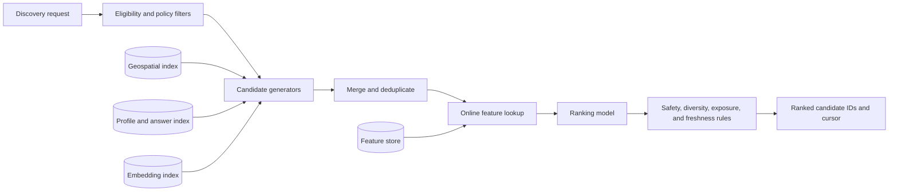
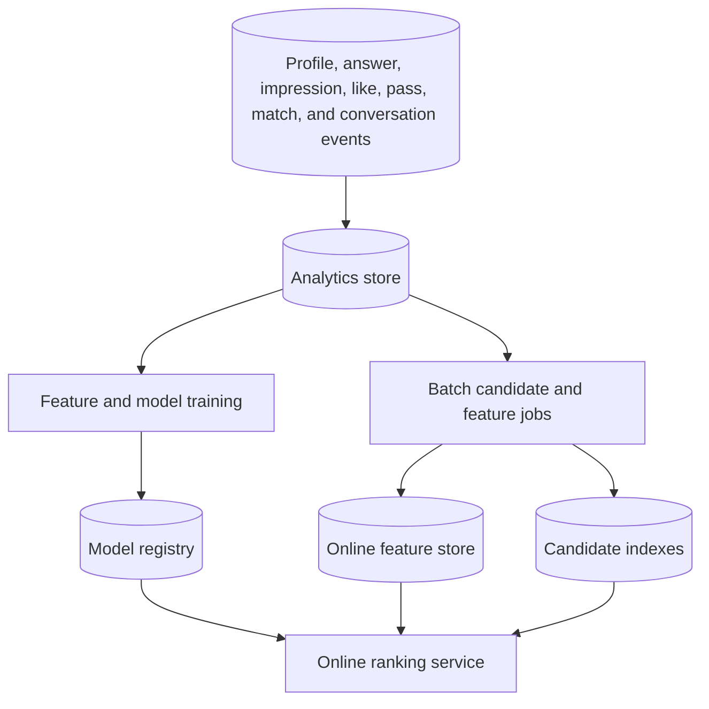

**Dating site matching and ranking** is a multi-stage recommendation pipeline. It first removes ineligible people, then finds plausible candidates, calculates richer scores for a small set, and applies product and safety rules to the final order.

A compatibility percentage is only one ranking feature. It is not the complete recommendation system.

## Online pipeline

## Stage 1: eligibility

Apply hard rules before costly scoring:

- Both accounts are active and discoverable.
- Age and regional eligibility rules pass.
- Both users are adults, or both users are in compatible country-approved minor cohorts. Adult-to-minor candidates are always denied.
- Each user fits the other's gender, age, distance, and relationship preferences.
- Neither user blocked the other.
- The candidate was not recently passed, hidden, or already exhausted by the policy.
- Safety and moderation restrictions pass.
- The product has enough coarse location information to evaluate distance without exposing exact coordinates.

Use a geospatial index or spatial database for distance filtering. Store and expose only the precision that the product needs.

## Stage 2: candidate generation

One generator is not sufficient. Run several inexpensive generators and combine their IDs:

| Generator | Finds | Cold-start value |
| --- | --- | --- |
| Explicit preferences | Candidates who pass declared filters | High |
| Question compatibility | Candidates with compatible answer vectors | High after some answers |
| Content similarity | Candidates with related profile attributes and interests | Medium |
| Collaborative retrieval | Candidates inferred from interaction patterns | Low for a new user |
| Embedding nearest neighbors | Candidates close in a learned representation | Low until training data exists |
| Exploration pool | New, under-exposed, or uncertain candidates | High for system learning |

Retrieve hundreds or thousands of IDs, not full profiles. Deduplicate them and retain the source of each candidate as a ranking feature.

Question compatibility consumes both sets from [[Dating Site Question and Answer System]]: each user's own selected options and the options that user accepts from a partner. For multi-select questions, apply the stored evaluation mode before importance weighting.

## Stage 3: ranking

The ranker predicts outcomes for the requesting user and candidate. Dating is a two-sided market, so the model should estimate mutual value rather than only the requester's click probability.

Example components are:

$$
S(u,v) =
w_c C(u,v) +
w_m P(u \rightarrow v)P(v \rightarrow u) +
w_q Q(u,v) +
w_f F(v) -
w_r R(u,v)
$$

where:

- $C(u,v)$ is explicit compatibility.
- $P(u \rightarrow v)$ and $P(v \rightarrow u)$ estimate mutual interest.
- $Q(u,v)$ estimates conversation or relationship quality.
- $F(v)$ is a bounded freshness term.
- $R(u,v)$ is a safety or negative-experience risk term.

The exact function is a product and policy decision. Do not optimize only for swipes, time in the application, or message count. Those targets can reward poor experiences.

## Stage 4: post-processing

Apply deterministic rules after model scoring:

- Remove late block or policy changes.
- Limit near-duplicate profiles in one page.
- Control repeated exposure.
- Reserve a measured exploration share.
- Add diversity without violating the user's explicit preferences.
- Enforce fairness and safety constraints.
- Return an opaque cursor. Do not use offset pagination on a changing ranked list.

## Offline and online data

Point-in-time-correct training data is essential. Do not let future events leak into historical features. Record model version, feature version, candidate-source IDs, and policy version for each served recommendation so that results can be audited.

## Serving and caching

- Precompute stable features and candidate indexes in batch or streaming jobs.
- Calculate request-context features online.
- Cache a bounded list of ranked candidate IDs per user with a short expiry.
- Hydrate only the IDs needed for the current page from profile and media projections.
- Invalidate or filter cached lists after block, suspension, deletion, or visibility changes.
- Degrade to explicit filters plus a simple compatibility score when the model or feature store is unavailable.

## Match creation

Likes and matches need transactional rules. Store a directional interaction with a unique key such as `(ActorUserId, TargetUserId, InteractionType)`. When the second compatible like arrives, create one match with a canonical pair key such as `(MinUserId, MaxUserId)`. A unique constraint makes retries safe.

Publish `MatchCreated` only through the transactional outbox. Chat consumes that event, but it must still verify current match and block state before it accepts a message.

Age-group authorization is a transactional hard rule, not a ranking feature. Recheck it when a like creates a match and when an age-boundary event occurs. Remove stale candidates and close invalid matches before a user enters a new age group. See [[Dating Site Minor Safety]].

## Evaluation

Use offline metrics for model development and guarded online experiments for product decisions.

| Area | Example metrics |
| --- | --- |
| Retrieval | Recall at K, eligible-candidate coverage |
| Ranking | Normalized discounted cumulative gain, calibration, mutual-like rate |
| Product quality | Meaningful-conversation rate, reply rate, unmatch rate, report rate |
| Fairness | Exposure and outcome differences across policy-approved cohorts |
| Reliability | Ranking latency, feature freshness, fallback rate, empty-result rate |

## Sources

- [ByteByteGo: Video Recommendation System](https://bytebytego.com/courses/machine-learning-system-design-interview/video-recommendation-system)
- [ByteByteGo: Design A News Feed System](https://bytebytego.com/courses/system-design-interview/design-a-news-feed-system)
- [[OkCupid Matching Algorithm]]
- [[Content-based Filtering]]
- [[Neighborhood Collaborative Filtering]]
- [[Hybrid Recommenders]]

