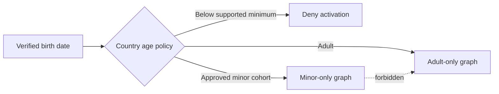

**Dating site minor safety** is a separate product policy, not one moderation rule. If the service permits approved users below 18, it must prevent adult-to-minor discovery and contact and reduce grooming, coercion, sexual exploitation, and location disclosure.

Launching for minors requires a country-by-country legal and safety assessment. If the product cannot operate a safe minor cohort in a country, it must not activate minors in that country.

## Hard separation

Adults and minors must never share a discovery, matching, or chat graph.

Apply the separation in the transactional match command and chat authorization. Search filters and cached candidate lists are not sufficient. Use narrow, country-approved age differences inside each minor cohort.

## Default controls for a minor account

- Make the profile private by default and visible only to an eligible minor cohort.
- Do not show an exact birth date, school, workplace, home address, or precise location.
- Show coarse distance only when the country policy permits it.
- Use optional GPS only inside the location-verification boundary. Delete coordinates after deriving the country and never expose them to another user.
- Do not let another user download profile media through a normal application action.
- Disable external profile links until a documented trust threshold is met.
- Restrict links and attachments in new conversations.
- Disable discoverability by phone number, email address, and external search engines.
- Disable read receipts, activity status, streaks, and pressure-based notifications by default.
- Give block and report controls a permanent and visible position.
- Do not add a minor to a group or conversation without the minor's action. This architecture permits one-to-one chat only.

## Predatory-behavior controls

Identity verification reduces anonymous abuse, but it does not make a person safe. Detect patterns, not only individual messages:

- attempts to move a conversation to another service immediately;
- repeated requests for secrecy, sexual content, money, identity documents, or precise location;
- an account that contacts many younger users with similar messages;
- age, identity, device, or country signals that conflict;
- repeated account creation after blocks or suspensions;
- rapid trust-building followed by coercion or financial requests.

Use automated detection as a signal for friction, warning, or review. Do not make a severe final decision from one weak signal. Keep a reviewed emergency path for credible threats and child-safety reports.

## Conversation controls

Before the first message, verify that both users are active, in compatible minor cohorts, mutually matched, and not blocked. Repeat the current policy check for every message and history request.

For higher-risk events, the service can:

- show an in-context safety warning;
- delay or block a new external link;
- require a fresh passkey authentication or identity step-up;
- limit attachments;
- place the conversation in restricted review;
- preserve the minimum evidence required for a report;
- suspend delivery immediately when policy requires it.

Document the lawful basis, transparency, access restrictions, retention, and appeal process for message analysis. Do not use minor messages for advertising or general model training.

## Age-boundary transition

An eighteenth birthday or another national boundary must be an atomic policy transition:

1. Remove the account from minor discovery.
2. Close or freeze minor conversations according to the approved policy.
3. Re-evaluate all matches.
4. Record required adult notices and consent.
5. add the account to adult discovery only after all prior steps succeed.

Do not carry an adult-to-minor conversation across the transition. A scheduled event can start the workflow, and a daily repair job must find missed transitions.

## Advertising and payments

Do not use profiling-based advertising for minors. The Digital Services Act prohibits this when the platform knows with reasonable certainty that the user is a minor. Prefer no third-party ads for minors. If the product uses advertising for a minor cohort after legal review, use controlled contextual placements and do not disclose dating attributes to an ad provider.

Review subscription contracts, refunds, guardian involvement, and payment methods for each country. A verified payment method is not proof of age or guardian consent.

## Operational checks

- Test that no adult can retrieve, like, match, or message a minor through any API.
- Test stale search indexes, cached pages, delayed events, and birthday transitions.
- Measure unwanted-contact reports, repeat offenders, link warnings, response time, and appeal outcomes by policy group.
- Red-team grooming paths before launch and after each important feature change.
- Give trained reviewers specific minor-safety access and guidance.
- Run an incident exercise for imminent harm and required authority reporting.

## Sources

- [Digital Services Act, Article 28](https://eur-lex.europa.eu/legal-content/EN/TXT/?uri=CELEX%3A32022R2065)
- [European Commission: Guidelines on the protection of minors](https://digital-strategy.ec.europa.eu/en/library/commission-publishes-guidelines-protection-minors)
- [European Commission: Impact of the Digital Services Act](https://digital-strategy.ec.europa.eu/en/policies/dsa-impact-platforms)
- [EDPB Statement 1/2025 on Age Assurance](https://www.edpb.europa.eu/documents/statement/statement-12025-on-age-assurance_en)
- [[Dating Site Age Assurance]]
- [[Dating Site Trust and Safety]]
- [[Dating Site One-to-One Chat]]
