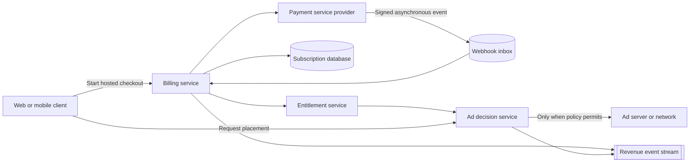
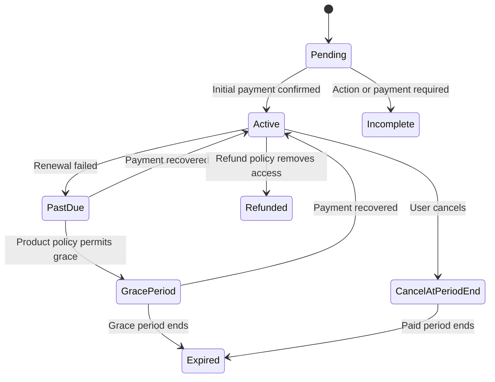
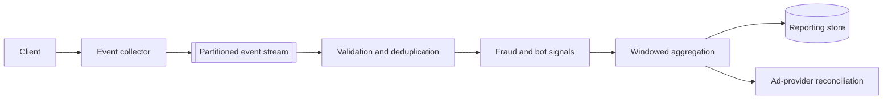

**Dating site monetization** funds the service through advertising and an optional paid subscription that grants an ad-free experience. Payment state, product entitlements, advertising policy, and revenue analytics are separate concerns.

## Boundary

Use a payment service provider (**PSP**) for payment details, payment authentication, recurring billing, refunds, and provider-side fraud controls. The dating site stores provider references and its own subscription mirror. It does not store raw card data.

The product consumes an internal entitlement such as `AdFree`. It does not interpret provider-specific payment states.

## Subscription and entitlement model

| Record | Important fields |
| --- | --- |
| `ProductPlan` | Internal plan ID, provider price references, region, currency, billing period, active dates |
| `CustomerReference` | User ID, provider, provider customer ID |
| `Subscription` | Internal ID, user ID, provider subscription ID, status, period end, cancellation state |
| `PaymentEventInbox` | Provider event ID, received time, signature result, processing state, payload reference |
| `Entitlement` | User ID, feature key such as `AdFree`, valid from, valid until, source, revision |
| `RefundRecord` | Internal ID, provider reference, amount, currency, reason, status |

The entitlement is a derived product fact. A subscription can grant more than one entitlement later without changing the payment integration.

## Purchase flow

1. The client requests checkout for an internal plan ID and supplies an idempotency key.
2. The billing service maps the plan to the correct provider price for the user's region and channel.
3. The PSP hosts the payment page or approved payment fields.
4. The client return page shows a pending state. It does not grant access from a redirect parameter.
5. A verified asynchronous provider event enters an inbox with a unique provider event ID.
6. An idempotent consumer updates the subscription mirror and entitlement.
7. An outbox event invalidates the user's entitlement cache.
8. A reconciliation job compares local subscription records with provider reports.

Mobile applications can have store-specific billing requirements. Treat each store as another provider adapter. Verify store transactions on the server and convert them to the same internal entitlement.

## Subscription states

Provider statuses do not have to match these internal states one for one. Map them in the provider adapter. Record the provider payload version and mapping version for audit and replay.

## Ad decision flow

The client asks the ad decision service whether a placement is permitted. The decision uses only the minimum required data:

1. Check that the user does not have the `AdFree` entitlement.
2. Check age, region, consent, privacy choice, and placement policy.
3. Return no third-party ad for a minor unless a country-specific legal and safety review explicitly permits a controlled contextual placement. Never use profiling-based advertising for a minor.
4. Prefer contextual input such as screen type and broad language for eligible adults.
5. Do not send question answers, sexual orientation, relationship preferences, messages, identity claims, precise location, report history, or other sensitive dating attributes to an ad provider.
6. Return an ad, a house promotion, or an empty placement.

The ad provider must not decide product authorization. If the entitlement service is unavailable, use a short local cache. Choose the failure policy explicitly. For a paid user experience, stale positive `AdFree` access should normally continue for a bounded period.

## Impression and click accounting

Ad rendering and revenue reporting are asynchronous workloads.

- Give each impression and click an opaque event ID.
- Validate that the placement was issued and has not expired.
- Partition events by placement or campaign while monitoring hot partitions.
- Keep raw events under a defined retention policy.
- Deduplicate before aggregation.
- Separate billing-grade reconciliation data from near-real-time dashboards.
- Never let analytics failure block profile, match, or chat requests.

## Payment safety

- Use hosted checkout or provider-hosted payment elements to reduce card-data exposure.
- Verify webhook signatures and reject stale events according to provider guidance.
- Store each provider event once. Processing retries must be idempotent.
- Use idempotency keys for outbound create, change, refund, and cancellation calls.
- Keep a double-entry ledger if the product later holds balances, gives credits, or pays third parties. A simple ad-free subscription does not need an internal wallet.
- Separate support permissions for refund, plan change, and data viewing.
- Audit all manual billing actions.
- Test renewal, failed payment, duplicate webhook, delayed webhook, refund, dispute, cancellation, and provider outage paths.

## Availability

Payment-provider failure must not stop the dating site. It can stop new purchases and plan changes. Existing entitlements remain available from the internal store. Ad-provider failure returns an empty placement or a house promotion.

## Sources

- [ByteByteGo: Payment System](https://bytebytego.com/guides/payment-system/)
- [ByteByteGo: Ad Click Event Aggregation](https://bytebytego.com/courses/system-design-interview/ad-click-event-aggregation)
- [ByteByteGo: Payment and Fintech](https://bytebytego.com/guides/payment-and-fintech/)
- [Stripe: Using webhooks with subscriptions](https://docs.stripe.com/billing/subscriptions/webhooks)
- [Stripe: Idempotent requests](https://docs.stripe.com/api/idempotent_requests)
- [PCI Security Standards Council: SAQ A payment-page eligibility](https://www.pcisecuritystandards.org/faqs/if-a-merchant-s-e-commerce-implementation-meets-the-criteria-that-all-elements-of-payment-pages-originate-from-a-pci-dss-compliant-service-provider-is-the-merchant-eligible-to-complete-saq-a-or-saq-a-ep/)
- [European Commission: Impact of the Digital Services Act](https://digital-strategy.ec.europa.eu/en/policies/dsa-impact-platforms)
- [[Dating Site Minor Safety]]

