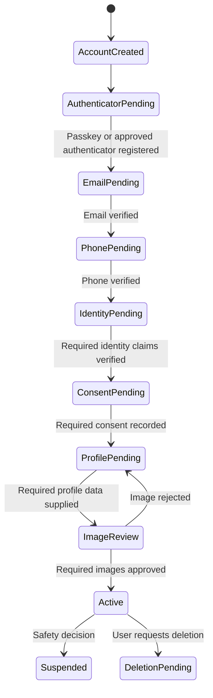

**Dating site onboarding** creates an application account, registers a passkey or another approved authenticator, verifies email and phone control, verifies required identity claims, records consent, collects the minimum profile data, and activates discovery only after all required checks pass.

Email and phone verification prove that the user controlled those channels during verification. A passkey proves control of an account credential. These checks do not prove the person's name, age, residence, or legal identity. [[Dating Site Identity Verification]] is a separate gate.

## Activation workflow

The order can change in the user interface, but activation requires all gates. Keep the state on the server. A client flag must never activate an account.

## Contact-point model

| Field | Purpose |
| --- | --- |
| `ContactPointId` | Opaque identifier |
| `UserId` | Owning application user |
| `Type` | `Email` or `Phone` |
| `OriginalValue` | Value for display and delivery under restricted access |
| `NormalizedValueHash` | Lookup and uniqueness without exposing the value in normal logs |
| `VerificationState` | Pending, verified, expired, replaced, or blocked |
| `VerifiedAt` | Last successful proof-of-control time |
| `ChangedAt` | Last replacement time |
| `ProviderReference` | Provider request reference for support and audit |

Store the protected normalized value when delivery requires it. Use field encryption and strict access. Keep its hash for lookup. Store phone numbers in E.164 form. Preserve the email spelling supplied by the user and apply one documented normalization rule. Do not remove dots or plus suffixes for all email providers.

For an abuse-resistant dating product, one normalized email and one normalized phone number should normally map to only one active account. Provide a reviewed recovery path for recycled phone numbers and account-loss cases. Do not reveal the existing account during that process.

## Email verification

1. The user supplies an email address.
2. The onboarding service creates a random, single-use challenge with a short expiry.
3. Store only a protected hash of the secret when the application manages the challenge.
4. Send a link through an email delivery provider.
5. The landing page exchanges the secret for a server-side verification result.
6. Mark the address verified, consume the challenge, and publish `EmailVerified`.

The link must be bound to the intended account and action. Do not put access tokens, profile data, or a raw email address in the link. A resend invalidates or reuses the existing challenge according to one documented policy.

## Phone verification

Use a phone-verification provider where possible. It handles delivery routes, regional restrictions, fraud controls, and status checks.

1. Parse and normalize the number to E.164 form.
2. Check country policy, destination risk, account limits, and resend limits.
3. Ask the provider to send a short-lived one-time code by an allowed channel.
4. Submit the code to the provider through the backend.
5. On success, mark the phone verified and publish `PhoneVerified`.

Accept a code only once. Limit attempts. SMS and voice delivery over the public telephone network are vulnerable to number porting, SIM swap, interception, and recycled numbers. Phone verification must not be the only strong authenticator or recovery method.

## Rate limits and abuse controls

Apply separate token-bucket or sliding-window limits to challenge creation and challenge checks.

| Key | Example protection goal |
| --- | --- |
| Account ID | Stop one account from sending many messages |
| Normalized destination hash | Stop repeated sends to one email address or phone number |
| IP address or prefix | Slow automated account creation |
| Device or risk identifier | Detect distributed destination abuse |
| Country and carrier | Control toll fraud and unsupported routes |

Use generic responses where an address or number can already exist. Add increasing resend delay and a daily ceiling. Return `429 Too Many Requests` with a safe retry time. Do not log codes or full destinations.

## Contact changes

Changing a verified contact point is a security-sensitive operation:

1. Require recent authentication or step-up authentication.
2. Verify the new contact point before replacement.
3. Notify the old contact point without including sensitive profile details.
4. Apply a short risk-based cooling period to high-risk actions.
5. Revoke recovery sessions created before the change.
6. Record an audit event and notify trust and safety when risk signals require review.

Loss of one contact channel must not let an attacker replace both channels. Provide recovery codes, passkeys, another strong authenticator, or a reviewed recovery process.

## Identity and location checks

The identity gate must verify the legal name, exact date of birth, and required country claims under [[Dating Site Identity Verification]]. It then applies [[Dating Site Age Assurance]] and [[Dating Site Minor Safety]].

An optional location-plausibility step can compare the claimed residence country with IP-derived and device-derived countries. Ask for GPS permission only when the purpose and risk justify it. Refusal or mismatch must have another verification or review path.

## Service events

- `AccountCreated`
- `EmailVerificationRequested`
- `EmailVerified`
- `PhoneVerificationRequested`
- `PhoneVerified`
- `PasskeyRegistered`
- `IdentityClaimsVerified`
- `BirthDateVerified`
- `LocationPlausibilityEvaluated`
- `RequiredConsentRecorded`
- `ProfileActivationRequested`
- `UserActivated`
- `ContactPointChanged`

Write state and its outbox event in one transaction. Event consumers must be idempotent. The profile, matching, and chat services accept only active users.

## Sources

- [NIST SP 800-63-4: Digital Identity Guidelines](https://pages.nist.gov/800-63-4/sp800-63.html)
- [NIST SP 800-63B: Authenticator and Verifier Requirements](https://pages.nist.gov/800-63-4/sp800-63b/authenticators/)
- [Twilio Verify: Rate Limits and Timeouts](https://www.twilio.com/docs/verify/api/rate-limits-and-timeouts)
- [Twilio Verify: Programmable Rate Limits](https://www.twilio.com/docs/verify/api/programmable-rate-limits)
- [OWASP Forgot Password Cheat Sheet](https://cheatsheetseries.owasp.org/cheatsheets/Forgot_Password_Cheat_Sheet.html)
- [[Dating Site Identity and Access]]
- [[Dating Site Identity Verification]]
- [[Dating Site Age Assurance]]
- [[Dating Site Minor Safety]]
- [[Dating Site Image Management]]
