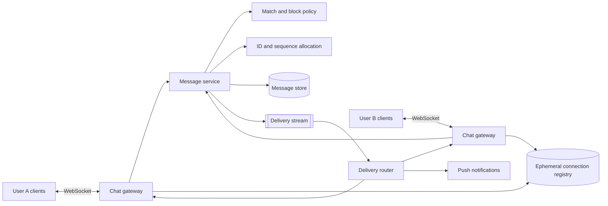
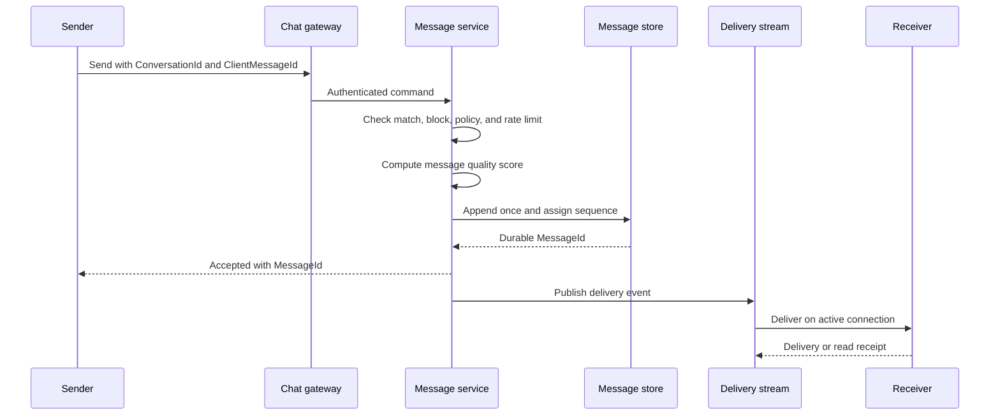

---
title: Dating Site One-to-One Chat
---
**Dating site one-to-one chat** provides durable, ordered message history and low-latency live delivery for two matched users. The durable message record is the source of truth. WebSocket delivery is a fast path, not the source of truth.

## Logical components

These are required behaviors. An existing chat service can supply several boxes.

Use normal HTTPS APIs for conversation lists, history synchronization, media-upload setup, and account actions. Use WebSocket for new messages, receipts, typing state, and connection heartbeats.

## Adopt or build

Prefer an existing chat service for the first implementation. Matrix Synapse is one self-hosted candidate. A managed Matrix or commercial chat service can reduce operations further.

| Choice | Benefit | Cost or constraint |
| --- | --- | --- |
| Self-hosted Matrix | Open protocol, message history, device synchronization, receipts, push support, optional end-to-end encryption | Server operation, upgrades, storage, safety integration, and client integration |
| Managed chat | Fast delivery and less on-call work | Recurring cost, data location, retention, export, and vendor lock-in |
| Custom chat | Full control of protocol, storage, moderation, and cost model | Rebuilds ordering, retries, multi-device sync, push, presence, abuse controls, and operations |

For Matrix, disable public registration, public rooms, and federation unless the product explicitly needs them. A dating-to-chat adapter creates one private room for one active match and maps the internal user IDs to chat identities. The adapter applies block, unmatch, suspension, and deletion events.

The rest of this note is the behavior contract for any selected chat product. Do not expose provider room IDs or provider-specific message states to the rest of the dating domain.

## Conversation rule

One active mutual match grants access to at most one one-to-one conversation. A canonical pair key prevents duplicate conversations. Unmatch, block, suspension, or deletion closes or restricts the conversation according to policy.

The message service checks current authorization, including the age-cohort rule, when:

- a WebSocket connects or resumes;
- a message is sent;
- message history is requested;
- an attachment is resolved;
- a block, unmatch, or moderation event arrives.

Do not rely only on the authorization state that existed when the socket opened.

## Send flow

A client-generated `ClientMessageId` makes retries idempotent. The server assigns the durable `MessageId`. Use a monotonic sequence within each conversation for synchronization and display order. A globally sortable ID such as a Snowflake-style ID can also help with storage and operations, but it does not replace the per-conversation sequence.

## Delivery semantics

Use **at-least-once delivery** with deduplication. Exactly-once delivery across clients, queues, and databases is not a realistic end-to-end contract.

- Persist before acknowledging the sender.
- A duplicate send with the same client message ID returns the first result.
- A receiver stores the largest contiguous sequence it has synchronized.
- On reconnect, the client requests messages after its last stored sequence.
- Delivery and read receipts are separate, idempotent state changes.
- Typing indicators and online presence are ephemeral. They can be lost.

## Message quality scoring

Use an input-effort score to reduce the rank of messages that were likely pasted or generated outside the chat composer. This is a quality signal, not proof that a message was copied or generated by a large language model.

For a text message, let:

- $C$ be the final count of user-perceived characters after normalization;
- $K$ be the number of content-entry keystrokes or equivalent input actions recorded while the draft was written;
- $W$ be the server-computed word count.

Calculate a logarithmic input-effort discount:

$$
D_E = \alpha_E \max\left(0, \ln\left(\frac{C}{\max(K, 1)}\right)\right)
$$

When $C > K$, $D_E$ is positive and increases logarithmically as the difference grows. A normal typed message usually has $K \ge C$ because corrections and navigation add keystrokes. A pasted message usually adds many characters with few input actions.

Calculate a logarithmic length discount:

$$
D_W = \alpha_S \max\left(0, \ln\left(\frac{50}{\max(W, 1)}\right)\right)
+ \alpha_L \max\left(0, \ln\left(\frac{\max(W, 1)}{200}\right)\right)
$$

The values 50 and 200 define a preferred range, not hard limits. A message just outside the range receives only a small discount. The discount grows gradually as the word count moves farther away. The separate $\alpha_S$ and $\alpha_L$ weights let the product tune short and long messages independently.

A candidate normalized quality score is:

$$
Q = \frac{1}{1 + D_E + D_W}
$$

Keep the weights and reference points versioned so that product data can tune them without changing stored messages. Use $Q$ to rank message quality or as one input to sender reputation. Do not reject, hide, or penalize an account from this signal alone.

The first-party client collects only aggregate draft metrics. It resets them after a successful send, not when focus changes. It distinguishes normal text entry from paste, drop, autocomplete, speech input, and input method editor composition. Mobile keyboards, accessibility tools, and non-Latin input methods must receive keystroke-equivalent credit so that the score does not treat them as pasted text. Do not collect the keys, clipboard content, or draft history.

When the service can inspect plaintext, the server recomputes $C$ and $W$ from the accepted message. With end-to-end encryption, the client computes all composition signals and the server cannot verify them. The server validates the available counts, calculates $Q$, and stores the scoring version. Client metrics can be falsified, so this mechanism is a ranking heuristic and not an abuse-prevention boundary.

## Storage

Partition messages by `ConversationId`. This keeps one conversation together and preserves local ordering. A message record can contain:

| Field | Purpose |
| --- | --- |
| `ConversationId` | Partition and authorization boundary |
| `Sequence` | Order and synchronization cursor |
| `MessageId` | Stable server identifier |
| `ClientMessageId` | Retry deduplication |
| `SenderUserId` | Sender identity |
| `CreatedAt` | Server acceptance time |
| `Kind` | Text, image reference, or system event |
| `Content` | Encrypted text or a validated attachment reference |
| `ModerationState` | Policy state without changing message identity |
| `QualityScore` | Versioned server-derived message quality score |
| `CompositionSignals` | Aggregate counts used to reproduce the score; never raw keys or clipboard content |

Store conversation metadata separately from message bodies. Keep per-user conversation state, such as archive and last-read sequence, in a table keyed by `(UserId, ConversationId)`.

## Connection scaling

- Chat gateways keep connections but do not own durable messages.
- Register each active device connection with a short lease and heartbeat.
- Route delivery through a partitioned stream. Partition by conversation ID to preserve order.
- Apply connection limits by user and device.
- Drain a gateway before deployment. Clients reconnect with exponential backoff and jitter.
- If live delivery fails, history synchronization still recovers every durable message.

## Safety and privacy

- Deny every adult-to-minor conversation, even when a stale match or provider room exists.
- Apply the stricter minor conversation policy when both participants are in an approved minor cohort.
- Re-evaluate and close conversations before an age-boundary transition completes.
- Rate-limit new messages, repeated content, links, attachments, and failed sends.
- Apply block and unmatch changes before later queued deliveries.
- Let users report a message and preserve the minimum evidence required by policy.
- Keep push notification text private by default.
- Use TLS for all network traffic and managed encryption for stored data.
- Use a fresh passkey check or identity step-up for high-risk account and safety actions.

[[Dating Site Minor Safety]] defines warnings, link and attachment controls, grooming signals, evidence limits, and age-boundary behavior.
- Decide early whether end-to-end encryption is a requirement. It changes multi-device sync, search, moderation, abuse review, and key recovery.

## Sources

- [ByteByteGo: Design A Chat System](https://bytebytego.com/courses/system-design-interview/design-a-chat-system)
- [ByteByteGo: Designing a Chat Application](https://bytebytego.com/guides/guides/how-do-we-design-a-chat-application-like-whatsapp-facebook-messenger-or-discord/)
- [ByteByteGo: Design A Distributed Message Queue](https://bytebytego.com/courses/system-design-interview/design-a-distributed-message-queue)
- [Matrix end-to-end encryption implementation guide](https://matrix.org/docs/matrix-concepts/end-to-end-encryption/)
- [[Dating Site Platform Services]]
- [[Twitter Snowflake]]
