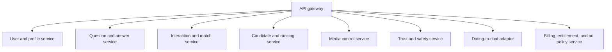
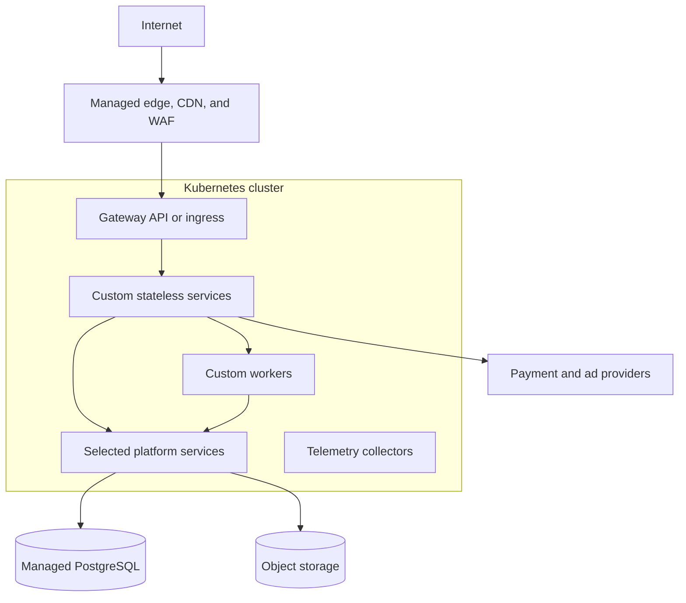

---
title: Dating Site Platform Services
---
**Dating site platform services** supply standard infrastructure so that custom code can focus on profiles, compatibility, matching, safety, and monetization rules.

Using a proven service reduces implementation risk. It does not remove integration, upgrade, backup, monitoring, privacy, or incident-response work. Every added service has an operational cost.

## Reference stack

This is a candidate stack, not a fixed product list. Select managed services when the team does not have the time and skill to operate a stateful product.

| Capability | Self-hosted candidate | Managed alternative | Dating-specific integration |
| --- | --- | --- | --- |
| Container platform | Kubernetes | Managed Kubernetes or container application platform | Namespaces, network policy, autoscaling, and deployment policy |
| Edge and API routing | Envoy Gateway, Kong, or Traefik | Cloud gateway and web application firewall | Routes, rate limits, token validation, and request limits |
| Authentication | Keycloak with WebAuthn | Managed OpenID Connect provider with passkeys | Map `(issuer, subject)` to the internal user; require user verification and secure recovery |
| Email and phone verification | SMTP service plus a verification service | Managed email and phone verification provider | Challenge policy, onboarding state, contact ownership, and recovery |
| Identity verification | EUDI wallet-compatible verifier | Trusted EU identity provider | Legal name, exact birth date, nationality, residence claims, holder binding, and minimization |
| Age assurance | Age policy service | Managed rules only where justified | Derive age group and schedule policy transitions from verified birth date |
| Location plausibility | IP geolocation database plus optional device location | EU-hosted risk provider | Derive country, discard coordinates, compare claims, and keep uncertainty |
| Fine-grained authorization | OpenFGA | Managed relationship-authorization service | Model owner, match, participant, block, reviewer, and staff relations |
| Transactional data | PostgreSQL with a supported operator | Managed PostgreSQL | Domain schemas, constraints, outbox, backup, and restore policy |
| Cache and ephemeral state | Valkey | Managed Redis-compatible cache | Ranked-list cache, rate limits, leases, and safe cache-miss behavior |
| Event stream and work queues | NATS JetStream, RabbitMQ, or Kafka | Managed broker or event stream | Versioned events, partition keys, retries, and dead-letter handling |
| Object storage | S3-compatible storage | Cloud object storage | Quarantine and published buckets, signed URLs, and retention |
| Image transformation | imgproxy or a similar sandboxed service | Managed image CDN | Fixed variants, metadata removal, processing limits, and safe source access |
| Malware scanning | ClamAV or a commercial scanner | Managed scanning pipeline | Quarantine decision and evidence |
| Search and vector retrieval | OpenSearch | Managed search or vector database | Geo filters, profile projection, vector candidates, and index rebuild |
| One-to-one chat | Matrix Synapse with federation disabled | Managed Matrix or chat provider | One match to one room, closed registration, block enforcement, and safety hooks |
| Payments and subscriptions | Do not build card processing | Payment service provider | Product catalog, subscription mirror, entitlements, and reconciliation |
| Advertising | Self-hosted ad server where justified | Ad network or managed ad server | Consent, placement rules, ad-free check, and safe context |
| Telemetry | OpenTelemetry Collector, Prometheus, Grafana, Loki, and Tempo | Managed observability platform | Redaction, service objectives, alerts, and retention |
| Secrets and certificates | cert-manager plus External Secrets or Vault | Cloud certificate and secret managers | Rotation, workload identity, and least privilege |

Start with one broker and one search product. Do not add separate products for task queues, event logs, full-text search, geospatial search, and vectors until measured limits require them.

## Custom services

The first custom deployables can be small and independently versioned:

Small services do not require one database cluster per service. They require clear data ownership. One PostgreSQL cluster can host separate databases or schemas with separate credentials at first. A service split must not create direct cross-service table reads.

## Chat build-or-adopt decision

Matrix can supply accounts, rooms, device synchronization, message history, receipts, attachments, push integration, and optional end-to-end encryption. Configure it as a closed system:

- disable public registration and public rooms;
- disable federation unless it is an explicit product feature;
- create accounts and one-to-one rooms through a controlled adapter;
- map one active dating match to one room;
- enforce block and unmatch changes through both the dating policy service and the chat server;
- decide whether end-to-end encryption is compatible with abuse reporting and moderation before implementation.

A managed chat service can reduce operational work, but it creates vendor, privacy, retention, and export constraints. A custom chat service gives full control but recreates difficult multi-device, ordering, retry, push, and abuse-control work. Use [[Dating Site One-to-One Chat]] as the required behavior contract for either choice.

## Kubernetes deployment

Use Docker Compose for local integration and small demonstrations. Use Kubernetes when production needs declarative deployments, horizontal scaling, isolation, rolling updates, and a common operator model.

Prefer managed storage outside the cluster for the primary database and object data where possible. If a stateful service runs in Kubernetes, use its supported operator or chart, persistent volumes, disruption budgets, topology spread, tested backups, and documented upgrade and restore procedures. A `StatefulSet` supplies stable pod and storage identity. It does not operate the database for you.

## Selection criteria

Score each product against:

- license and total operating cost;
- data location, privacy, retention, export, and deletion support;
- high-availability model and tested failure behavior;
- backup, restore, upgrade, and migration procedures;
- horizontal scaling unit and hard service limits;
- observability and audit logs;
- supported identity and authorization integration;
- rate limits and degraded behavior;
- vendor lock-in and a tested exit path;
- team skill and on-call burden.

Run a proof of concept for the highest-risk integrations: OIDC passkey and recovery life cycle, email and phone verification, exact birth-date and identity verification, location plausibility, minor separation, block propagation to chat, direct image upload and moderation, subscription-to-entitlement updates, and search-index rebuild.

Do not run a custom SMTP or SMS delivery network unless messaging infrastructure is itself part of the product. Use a provider adapter so that delivery vendors can change without changing onboarding rules.

## Sources

- [ByteByteGo System Design Interview course](https://bytebytego.com/courses/system-design-interview/)
- [Keycloak Operator Installation](https://www.keycloak.org/operator/installation)
- [Keycloak High Availability Overview](https://www.keycloak.org/high-availability/introduction)
- [OpenFGA: Fine-Grained Authorization](https://openfga.dev/docs/fga)
- [OpenSearch k-NN query](https://docs.opensearch.org/latest/query-dsl/specialized/k-nn/)
- [Matrix end-to-end encryption implementation guide](https://matrix.org/docs/matrix-concepts/end-to-end-encryption/)
- [Kubernetes StatefulSets](https://kubernetes.io/docs/concepts/workloads/controllers/statefulset/)
- [Twilio Verify: Rate Limits and Timeouts](https://www.twilio.com/docs/verify/api/rate-limits-and-timeouts)
- [European Commission: EU Age Verification Solution](https://digital-strategy.ec.europa.eu/en/faqs/eu-age-verification-solution)
- [W3C Web Authentication Level 3](https://www.w3.org/TR/webauthn-3/)
- [[Dating Site Identity Verification]]
- [[Dating Site GDPR Compliance]]
