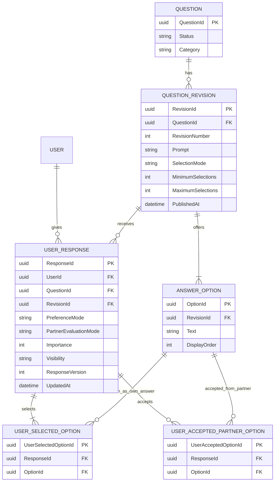
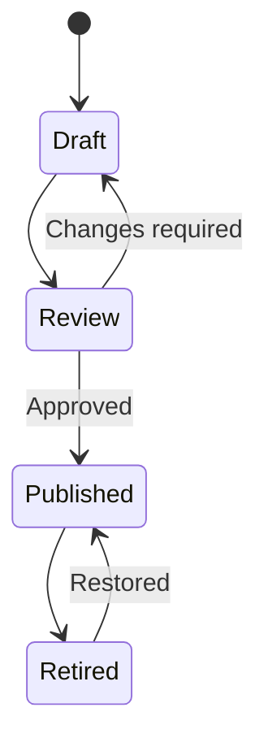

---
title: Dating Site Question and Answer System
---
The **dating site question and answer system** manages a versioned question catalog and each user's private answers, accepted partner answers, importance, and visibility choices.

The catalog is editorial data. User answers are personal data. They need different write paths, permissions, and scale strategies.

## Data model

`UserSelectedOption` stores the user's own answer set. `UserAcceptedPartnerOption` stores a separate set of answers that the user accepts from a potential partner. Neither table stores free text from the other table.

Add these constraints:

- one active `UserResponse` per `(UserId, QuestionId)`;
- one selected row per `(ResponseId, OptionId)`;
- one accepted row per `(ResponseId, OptionId)`;
- every selected and accepted option belongs to the response's question revision;
- selected-option count is between `MinimumSelections` and `MaximumSelections`;
- a restricted partner preference has at least one accepted option.

Use stable opaque IDs. Never use prompt or option text as a key. Published revisions are immutable. A material wording or option change creates a new revision. The product can then ask the user to confirm or replace an answer.

## Selection and acceptance semantics

`SelectionMode` describes the user's own answer shape:

| Mode | Cardinality |
| --- | --- |
| `Single` | Exactly one selected option |
| `Multiple` | Between the revision's minimum and maximum selection counts |

`PreferenceMode` distinguishes an ignored partner answer from a restricted set. Do not use an empty accepted-option set to mean both "any answer is acceptable" and "no answer is acceptable."

| Preference mode | Meaning |
| --- | --- |
| `Ignored` | The partner's answer does not affect compatibility; importance is zero |
| `Restricted` | One or more accepted partner options and an evaluation rule are present |

Let $A_u(q)$ be user $u$'s own selected-option set and $P_u(q)$ be the options that user $u$ accepts from a partner. For single-select questions, a partner satisfies the preference when their one selected option is in $P_u(q)$.

For multi-select questions, the product must select an explicit `PartnerEvaluationMode`:

| Evaluation mode | Partner satisfies user $u$ when |
| --- | --- |
| `AnySelectedAccepted` | $A_v(q) \cap P_u(q) \ne \varnothing$ |
| `AllSelectedAccepted` | $A_v(q) \subseteq P_u(q)$ |
| `ExactSet` | $A_v(q) = P_u(q)$ |

`AllSelectedAccepted` is a clear default for a multi-select question because one unacceptable partner selection cannot be hidden by one acceptable selection. A question can select another rule when its meaning requires it.

The original OkCupid public formula used one own answer and one or more acceptable partner answers. Multi-select own answers are an extension to that model. See [[OkCupid Matching Algorithm]].

## Catalog workflow

Catalog writes are rare and controlled. Catalog reads are frequent and cache well. Publish a versioned catalog snapshot to the CDN or distributed cache. The API can return changes since a catalog version.

## Answer write path

1. The client sends `QuestionId`, `RevisionId`, `SelectedOptionIds`, `AcceptedPartnerOptionIds`, preference mode, evaluation mode, importance, visibility, expected response version, and an idempotency key.
2. The API validates that all selected and accepted option IDs belong to the supplied revision and that both sets satisfy their cardinality rules.
3. In one transaction, the API upserts `UserResponse` and atomically replaces both option sets.
4. The same transaction writes an outbox event.
5. Consumers update compatibility features, search filters, and analytics.

Use optimistic concurrency with `ResponseVersion`. This prevents an offline device from silently replacing a newer response or only one of its two option sets.

If two users answered different question revisions, do not compare their option IDs directly. Require a new answer or use an explicit, reviewed option-migration map.

## Storage and partitioning

A relational database is a good system of record because catalog constraints and user-answer validation are relational. At larger scale:

- Partition `UserResponse` and its child selections by `UserId` or colocate them through the response partition key because profile and feature-building reads normally load one user's complete response sets.
- Add secondary indexes on selected or accepted option IDs only for approved aggregate or research uses.
- Keep raw answers out of the discovery index unless a field is needed for an explicit hard filter.
- Build compact per-user feature vectors asynchronously for matching.
- Cache the public catalog, not private answer sets.

## Privacy

- Separate answer visibility from use in matching. A private answer can affect a score without being shown to another user if the product policy permits it.
- Treat sensitive categories, free text, sexuality, religion, health, and political views according to regional privacy rules and explicit product policy.
- Limit staff access and record access to raw answers.
- Remove or anonymize answers through the account-deletion workflow.
- Publish only aggregated statistics that meet a defined privacy threshold.

## Question selection

The catalog service supplies eligible unanswered questions. A separate selector ranks them by expected value. Possible signals include population entropy, expected reduction in match uncertainty, category coverage, user effort, and freshness.

Do not mix this decision with candidate ranking. See [[OkCupid Question Selection Algorithm]] for the historical OkCupid method and an entropy-based reconstruction.

## Sources

- [ByteByteGo: Design A News Feed System](https://bytebytego.com/courses/system-design-interview/design-a-news-feed-system)
- [ByteByteGo: Scale From Zero To Millions Of Users](https://bytebytego.com/courses/system-design-interview/scale-from-zero-to-millions-of-users)
- [[OkCupid Questions]]
- [[OkCupid Matching Algorithm]]
- [[OkCupid Question Selection Algorithm]]
