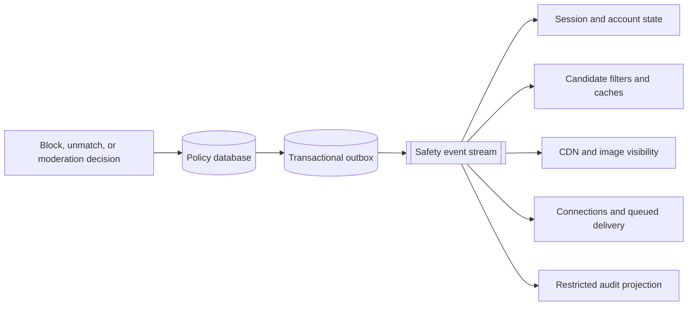

**Dating site trust and safety** prevents harmful accounts and content from reaching other users. It also gives users immediate controls to stop contact and gives staff an auditable review process.

Trust and safety is not a final filter after product development. It participates in registration, image publication, discovery, matching, and chat.

## Core controls

| Control | Synchronous effect | Asynchronous work |
| --- | --- | --- |
| Block | Remove both users from discovery and deny new messages immediately | Purge projections and queued notifications |
| Unmatch | Close the match and deny new messages | Update rankings and conversation lists |
| Report | Confirm receipt and apply emergency rules | Gather evidence and create a review case |
| Account suspension | Deny sessions and writes | Remove profile, images, matches, and pending deliveries from projections |
| Image rejection | Keep image unpublished | Store decision evidence and notify owner |
| Appeal | Record request | Route to a different reviewer where policy requires it |

## Event-driven policy propagation

The command result must take effect in its owning domain before success is returned. Derived systems can update asynchronously, but every read path must have a final policy check that stops stale projections from granting access.

## Moderation case model

A case refers to immutable evidence IDs. It does not copy more personal data than needed.

- `CaseId`, type, priority, state, and policy version
- reporter, subject, and affected resource IDs
- evidence references and cryptographic hashes
- automated signals with model and threshold versions
- reviewer assignments and decisions
- appeal state
- append-only audit entries

Separate operational moderation access from normal customer-support access. Apply least privilege. Record every view of sensitive evidence.

## Abuse resistance

- Rate-limit account creation, likes, messages, reports, image uploads, and account recovery.
- Treat verified identity, holder binding, passkey use, IP country, device country, and liveness as separate risk signals. None proves that a person is safe.
- Detect grooming patterns, adult-to-minor access attempts, repeated account creation, coordinated content farms, and identity conflicts.
- Enforce [[Dating Site Minor Safety]] in discovery, matching, chat, media, notifications, and review tools.
- Detect linked abusive accounts with reviewed risk signals. Do not make one weak signal an automatic final decision.
- Keep device and network risk data under a documented retention and access policy.
- Add friction in proportion to risk, such as verification or temporary limits.
- Test rules for false positives and unequal effects across user groups.
- Maintain an emergency process for credible threats and legal requests.

## Deletion and retention

Account deletion is a workflow across all data owners. Publish a deletion request with a stable workflow ID. Each domain confirms deletion or required retention. Backups expire under a documented schedule. Legal or safety holds must be explicit, access-controlled, and time-bound where law permits.

Do not promise immediate physical removal from every backup if the storage design cannot provide it. Disable access first, remove active projections, then complete deletion under the stated retention policy.

## Operational metrics

- Time from block to enforcement in discovery and chat
- Time from suspension to session denial
- Report queue age by severity
- Image moderation latency and appeal reversal rate
- False-positive and false-negative review samples
- Repeat-offender rate
- Percentage of safety events that fail or reach a dead-letter queue

## Sources

- [ByteByteGo: Design A Rate Limiter](https://bytebytego.com/courses/system-design-interview/design-a-rate-limiter)
- [ByteByteGo: Design A News Feed System](https://bytebytego.com/courses/system-design-interview/design-a-news-feed-system)
- [OWASP Authorization Cheat Sheet](https://cheatsheetseries.owasp.org/cheatsheets/Authorization_Cheat_Sheet.html)
- [OWASP File Upload Cheat Sheet](https://cheatsheetseries.owasp.org/cheatsheets/File_Upload_Cheat_Sheet.html)
- [European Commission: Guidelines on the protection of minors](https://digital-strategy.ec.europa.eu/en/library/commission-publishes-guidelines-protection-minors)
- [[Dating Site Identity Verification]]
- [[Dating Site Minor Safety]]

