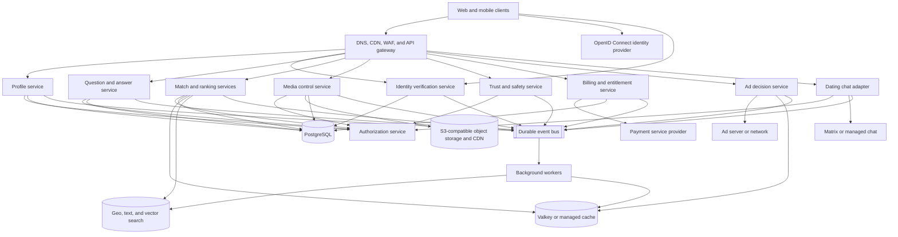
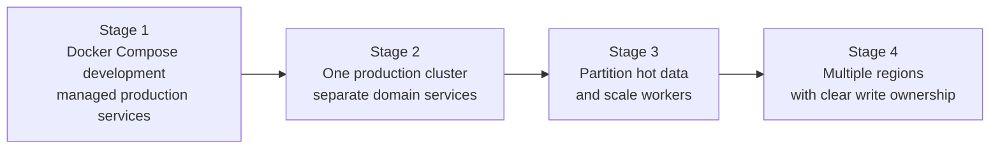

---
title: Dating Site Architecture
---
**Dating site architecture** must support secure accounts, private media, personalized discovery, real-time conversation, advertising, and subscriptions. These workloads have different scale and consistency needs. The design uses proven platform services where they fit and keeps custom code focused on dating-specific rules.

## Goals

- Scale read-heavy discovery separately from write-heavy chat and CPU-heavy image processing.
- Protect personal data, location, images, and messages.
- Give consistent results for account, consent, block, match, and deletion operations.
- Accept eventual consistency for search indexes, recommendations, counters, and notifications.
- Keep each domain's data under one owner.
- Support web and mobile clients.

The system must not treat engagement as its only goal. Safety, user choice, match quality, fairness, and useful conversations are also product goals.

## Service-first starting point

Use a **service-first platform**. Deploy established products for general infrastructure and protocols. Write small services only for product rules that are specific to dating.

Docker Compose can run the local environment. A managed container platform or Kubernetes can run production workloads when the team can operate it safely. Kubernetes provides deployment, discovery, health checks, scaling, and failure recovery. It does not remove the need to operate databases, backups, upgrades, or security.

| Capability | Prefer an existing service | Custom code remains responsible for |
| --- | --- | --- |
| Authentication | OpenID Connect provider with WebAuthn passkeys, such as Keycloak or a managed identity service | Account activation and dating-profile life cycle |
| Identity verification | EUDI verifier or approved EU identity provider | Required claims, country policy, minimization, and provider abstraction |
| Fine-grained authorization | OpenFGA or another policy service | Match, block, ownership, staff, and safety relations |
| Transactional storage | PostgreSQL service | Domain schemas and invariants |
| Cache and short-lived state | Valkey or a compatible managed cache | Cache keys, expiry, and safe fallbacks |
| Events and jobs | NATS JetStream, RabbitMQ, Kafka, or a managed service | Event contracts, outbox publication, and idempotent consumers |
| Images | S3-compatible object storage, CDN, image proxy, and malware scanner | Upload policy, ownership, moderation, and publication state |
| Search and retrieval | OpenSearch or another geo, text, and vector index | Eligibility, candidate generation, and ranking policy |
| Chat | Matrix homeserver or a managed chat service | Match-to-conversation mapping, block enforcement, and dating safety policy |
| Payments | Payment service provider and hosted checkout | Plans, subscription state, entitlements, and reconciliation |
| Advertising | Ad server or network | Consent, placement policy, ad-free checks, and safe context |
| Observability | OpenTelemetry, Prometheus, Grafana, logs, and traces | Useful signals, alerts, retention, and redaction |

[[Dating Site Platform Services]] compares these choices and their operational cost.

## High-level architecture

## Domain ownership

| Domain                                                            | Owns                                                                        | Does not own                         |
| ----------------------------------------------------------------- | --------------------------------------------------------------------------- | ------------------------------------ |
| [[Dating Site Identity and Access\|Identity and access]]          | Login identities, passkeys, sessions, account state, roles                   | Legal identity and dating profile data |
| [[Dating Site Onboarding\|Onboarding]]                            | Registration progress, verified contact points, activation checks           | Credentials and profile content      |
| [[Dating Site Identity Verification\|Identity verification]]      | Verified claims, assurance evidence, identity vault, location plausibility   | Login credentials and public profile |
| [[Dating Site Age Assurance\|Age assurance]]                     | Verified birth date, derived age group, next transition, policy version      | Source documents and biometrics      |
| [[Dating Site Minor Safety\|Minor safety]]                         | Minor cohorts, cross-age restrictions, minor protection policy               | Legal identity values                |
| [[Dating Site GDPR Compliance\|GDPR compliance]]                 | Processing rules, retention, rights, DPIA controls, data boundaries          | Business data owned by other domains |
| Profile                                                           | Display name, biography, preferences, coarse location, discovery visibility | Credentials and image bytes          |
| [[Dating Site Image Management\|Image management]]                | Upload state, object keys, variants, moderation state, image order          | General profile fields               |
| [[Dating Site Question and Answer System\|Questions and answers]] | Catalog revisions, options, user answers, acceptable answers, importance    | Ranked candidate lists               |
| [[Dating Site Matching and Ranking\|Matching and ranking]]        | Eligibility rules, features, candidate sets, scores, ranked result sets     | Source profile and answer records    |
| Match                                                             | Likes, passes, mutual matches, unmatches, blocks                            | Chat messages                        |
| [[Dating Site One-to-One Chat\|One-to-one chat]]                  | Conversations, messages, delivery state, read state                         | The decision that two users may talk |
| [[Dating Site Trust and Safety\|Trust and safety]]                | Reports, moderation decisions, policy actions, audit evidence               | Authentication credentials           |
| [[Dating Site Monetization\|Monetization]]                        | Plans, subscriptions, entitlements, ad decisions, revenue events            | Card data and dating-profile facts   |

Each domain publishes stable events. Consumers must not query another domain's private tables. Separate schemas, service credentials, and APIs enforce ownership even if several custom services share one PostgreSQL cluster at first.

## Important flows

### Registration and profile activation

1. The client registers or uses a passkey through the identity provider.
2. The application creates a user record with an idempotency key.
3. The user verifies control of both an email address and a phone number.
4. The user presents trusted evidence for legal name, exact birth date, and required country claims.
5. The service compares the claimed and verified birth dates and assigns a country-specific age policy group.
6. Optional IP and device location checks add residence-plausibility signals without proving residence.
7. The user accepts the current terms and supplies required profile data.
8. Images enter quarantine and pass validation and moderation.
9. The profile becomes discoverable only when identity, age, consent, media, and safety rules pass.

### Discovery and mutual match

1. Hard filters remove blocked, ineligible, invisible, and incompatible users. Adult and minor graphs are separate.
2. Candidate generators find a larger candidate set.
3. The ranker assigns a user-specific score.
4. Post-processing applies diversity, freshness, exposure, and safety rules.
5. A like is a transactional write. Two compatible likes create one mutual match.
6. A match event grants access to one conversation.

### Message delivery

1. The client opens an authenticated WebSocket connection.
2. The chat service checks the current match and block state.
3. It assigns a message ID and appends the message to durable storage.
4. It acknowledges the write to the sender.
5. It sends the message to the receiver's active connections or sends an offline push notification.

### Ads and ad-free subscription

1. The client requests a placement decision with a safe placement context.
2. The monetization service checks consent, age policy, region, and the `AdFree` entitlement.
3. Eligible free users receive an ad decision. Ad-free users receive no ad request.
4. A hosted payment flow creates or renews a subscription.
5. Verified provider events update the subscription record and the derived `AdFree` entitlement.
6. Impression and click events enter an asynchronous aggregation and fraud-detection pipeline.

## Consistency rules

| Data | Required model | Reason |
| --- | --- | --- |
| Account disable or delete | Strong for authorization decisions | A disabled account must lose access promptly |
| Block, unmatch, and chat permission | Strong or bounded-stale with immediate cache invalidation | A user must be able to stop contact |
| Mutual match creation | Transactional and idempotent | The pair must have at most one active match |
| Message append | Durable, ordered per conversation, idempotent | Retries must not create duplicate messages |
| Payment attempts and provider events | Durable, idempotent, and reconciled | Retries must not create double payment or double entitlement |
| Subscription entitlement | Strong or bounded-stale with prompt invalidation | Ad display must follow current access policy |
| Profile search index | Eventual | A short indexing delay is acceptable |
| Ranked recommendations | Eventual with a clear expiry | Rankings are derived data |
| Ad impression, click, and analytics counters | Eventual | They do not grant access |

Use a transactional outbox for events that follow SQL writes. Consumers must be idempotent. This prevents a database commit from succeeding while its event is lost.

## Scaling path

1. **Stage 1:** Use containers for a reproducible local stack. Prefer managed identity, SQL, object storage, payments, and other stateful services in production where cost and policy permit it.
2. **Stage 2:** Run small custom domain services and stateless integrations in one production cluster. Operate self-hosted platform services with supported operators and tested backup procedures.
3. **Stage 3:** Add read replicas, partition messages by conversation ID, partition answers by user ID, and maintain dedicated candidate indexes.
4. **Stage 4:** Assign each user a home region. Keep write ownership clear. Replicate public profile projections and media globally. Do not start with active-active writes for all data.

[[Dating Site Scaling and Operations]] gives the detailed capacity and reliability plan.

## Main design decisions

- Prefer an existing OpenID Connect provider over a custom password system.
- Use WebAuthn passkeys as a primary authentication method. Keep account recovery at the same security level.
- Keep legal identity in a restricted vault. Publish only the derived claims that each domain needs.
- Never permit discovery, matching, or chat between an adult and a minor.
- Prefer existing services for protocols and infrastructure. Keep dating rules in small owned services and adapters.
- Keep the system of record in transactional storage. Treat caches, search indexes, feature stores, and ranked lists as rebuildable projections.
- Upload image bytes directly to object storage with short-lived signed URLs. Do not proxy large uploads through the business API.
- Separate candidate generation from ranking. Do not score every user against every other user during a request.
- Allow chat only after a mutual match. Check block state on each send and connection resume.
- Use REST or HTTP for commands and synchronization. Use WebSocket only for live delivery.
- Store coarse or cell-based location for discovery. Restrict access to precise location.
- Convert payment-provider state into internal entitlements. Do not let feature code call the payment provider.
- Do not send answers, sexual orientation, precise location, message data, or other sensitive dating attributes to an ad network.

## Related notes

- [[OkCupid Matching Algorithm]]
- [[OkCupid Question Selection Algorithm]]
- [[Relationship Types]]
- [[Hybrid Recommenders]]
- [[Rate-Limiting Algorithms]]
- [[Scalability]]
- [[Secure System Design]]
- [[Dating Site Platform Services]]
- [[Dating Site Monetization]]
- [[Dating Site Onboarding]]
- [[Dating Site Identity Verification]]
- [[Dating Site Age Assurance]]
- [[Dating Site Minor Safety]]
- [[Dating Site GDPR Compliance]]

## Sources

- [ByteByteGo System Design Interview course](https://bytebytego.com/courses/system-design-interview/)
- [ByteByteGo: Scale From Zero To Millions Of Users](https://bytebytego.com/courses/system-design-interview/scale-from-zero-to-millions-of-users)
- [ByteByteGo: Design A News Feed System](https://bytebytego.com/courses/system-design-interview/design-a-news-feed-system)
- [ByteByteGo: System Design Blueprint](https://assets.bytebytego.com/System%20Design%20Blueprint.pdf)
