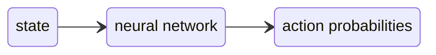

**Policy networks** estimate which action an agent should take in a given state. They are central to systems such as AlphaGo, AlphaZero, and AlphaStar because they narrow huge decision spaces to a smaller set of promising actions.

In reinforcement learning notation, a policy is usually written as:

$$
\pi(a \mid s)
$$

This means: the probability of choosing action $a$ in state $s$.

A policy network is a neural network approximation of that function:



## Why policy networks matter

Many games and planning problems have too many legal actions to search evenly.

Without a policy, a search algorithm may waste most of its work on moves that no strong player would consider. A policy network gives the search a useful prior:

| Without a policy | With a policy network |
| ---------------- | --------------------- |
| Explore legal moves more uniformly. | Focus early search on plausible moves. |
| Needs many simulations to reject bad moves. | Starts with domain-shaped preferences. |
| Relies heavily on random rollouts or heuristics. | Learns move preferences from data or self-play. |

The policy does not have to be perfect. It only needs to rank promising actions better than blind exploration.

## Output shape

Most policy networks output **logits**, one score per action. A softmax converts logits into probabilities:

$$
P(a_i \mid s) =
\frac{e^{z_i}}{\sum_j e^{z_j}}
$$

Here, $z_i$ is the logit for action $a_i$.

Illegal actions are usually masked before softmax so they receive probability zero.

```text
logits = network(state)
logits[illegal_actions] = -infinity
policy = softmax(logits)
```

## Policy networks and MCTS

In AlphaGo and AlphaZero-style systems, a policy network is usually combined with [[Monte Carlo Tree Search]].

The policy is not simply asked for one move. Instead, it provides priors for search. In AlphaGo and AlphaZero-style search, those priors are commonly used by [[Polynomial Upper Confidence Trees|PUCT]].

The policy prior says which moves deserve early attention. The search then corrects the policy by evaluating consequences.

This combination is powerful because the components solve different problems:

| Component | Role |
| --------- | ---- |
| Policy network | Suggest plausible actions. |
| Value network | Estimate the value of a state. |
| MCTS | Look ahead and refine the decision. |

## AlphaGo style

AlphaGo used policy networks to guide search in Go. The important idea is that the policy network learned move preferences from strong play and helped MCTS avoid spending equal effort on every legal move.

AlphaGo also used value estimation to reduce the need for long random rollouts.

Conceptually:

```text
board position
-> policy network suggests candidate moves
-> MCTS explores likely continuations
-> value estimate scores leaf positions
-> search returns a move
```

## AlphaZero style

AlphaZero removed the need for human expert games. It learned from self-play.

The training loop is roughly:

1. Use the current network to guide MCTS.
2. Play games against itself.
3. Store states, MCTS visit distributions, and final outcomes.
4. Train the policy head to predict the MCTS visit distribution.
5. Train the value head to predict the game outcome.
6. Repeat with the stronger network.

The policy target is not just the move that was played. It is often the visit-count distribution produced by search:

$$
\pi_{\text{target}}(a \mid s)
=
\frac{N(a)^{1/\tau}}{\sum_b N(b)^{1/\tau}}
$$

Here, $N(a)$ is the MCTS visit count for action $a$ and $\tau$ is a temperature parameter.

This makes the network imitate improved search, not merely raw game outcomes.

## AlphaStar style

AlphaStar used policy networks in a much more complex action space than Go or Chess.

Real-time strategy games have actions with structure:

| Action part | Example |
| ----------- | ------- |
| Ability | Move, attack, build, train, research. |
| Unit selection | Which units should execute the command. |
| Target | Position, enemy unit, friendly unit, or building. |
| Timing | When to act in a real-time sequence. |

This is not a simple "one softmax over all legal moves" problem. The policy is often decomposed into multiple heads or generated autoregressively:

```text
state
-> choose action type
-> choose selected units
-> choose target
-> choose additional arguments
```

That decomposition keeps the action space manageable.

## Policy head and value head

Many game-playing networks share a trunk and split into two heads:

```text
state
-> shared neural network
   -> policy head: action probabilities
   -> value head: expected outcome
```

The shared trunk learns useful features of the state. The policy head learns what to do. The value head learns how good the state is.

For two-player zero-sum games, the value is often in a range such as:

| Value | Meaning |
| -----: | ------- |
| $1$ | Current player is winning. |
| $0$ | Draw or neutral estimate. |
| $-1$ | Current player is losing. |

## Exploration controls

Policy networks can become too confident. Search and training usually add controlled exploration.

Common mechanisms:

| Mechanism | Purpose |
| --------- | ------- |
| Temperature | Makes action sampling more or less sharp. |
| Dirichlet noise | Adds root-level exploration during self-play. |
| Entropy bonus | Encourages non-collapsed policies during policy-gradient training. |
| Legal-action masking | Prevents probability mass from going to impossible actions. |

During training, sampling can be useful. During serious play, the system usually becomes greedier.

## Training styles

Policy networks can be trained in several ways:

| Training style | Target |
| -------------- | ------ |
| Supervised imitation | Predict actions from expert games. |
| Self-play with MCTS | Predict search visit distributions. |
| Policy gradient | Increase probability of actions that led to higher reward. |
| Actor-critic | Train policy and value estimates together. |

AlphaZero-style learning is especially interesting because the policy is trained to imitate a stronger planner created by the previous version of itself plus search.

## Practical caveats

A policy network is a prior, not a proof. It can miss rare tactics, overfit to common patterns, or assign low probability to creative but correct moves.

This is why strong systems often combine policy networks with search. The policy proposes. Search tests.

Important engineering details include:

- action encoding,
- legal-action masking,
- state representation,
- training target quality,
- temperature schedules,
- evaluation against older agents,
- handling hidden information or simultaneous moves.

## Use when

Policy networks are useful when:

- the action space is large,
- blind search wastes too much effort,
- useful training data or self-play is available,
- a heuristic prior is hard to write by hand,
- the policy can be corrected by search or value estimation.

For simple deterministic search problems, a handcrafted heuristic may be enough. For complex games, a policy network can become the search algorithm's sense of where to look first.
