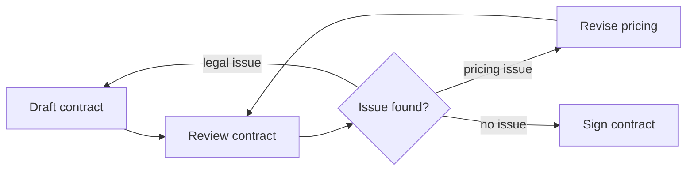

---
title: "Arbitrary Cycles"
category: "[[Control-Flow/_Control-Flow Patterns|Control-Flow Patterns]]"
group: "Iteration Patterns"
---
**Intent:** Allow control flow to return to an earlier point without requiring a single structured loop block.

**Use when:** Real process behavior can revisit earlier activities through several possible paths.

**Modeling notes:** Arbitrary cycles are expressive but can make reachability, termination, and joins hard to reason about. Use clear loop guards and avoid ambiguous joins inside cycles.

Source: [workflowpatterns.com](http://workflowpatterns.com/patterns/control/structural/wcp10.php).
