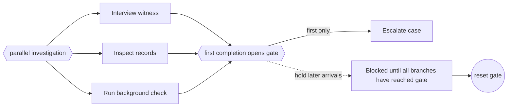

---
title: "Blocking Discriminator"
category: "[[Control-Flow/_Control-Flow Patterns|Control-Flow Patterns]]"
group: "Advanced Branching and Synchronization Patterns"
---
**Intent:** Continue on the first arriving branch while blocking later branch arrivals until the discriminator has reset.

**Use when:** Only one continuation may pass per branch set, and late arrivals must be held rather than cancelled or silently consumed.

**Modeling notes:** This variant differs from the structured discriminator by its blocking behavior for subsequent arrivals. It is useful when branch completions carry work that cannot be discarded but must not trigger the continuation.

Source: [workflowpatterns.com](http://workflowpatterns.com/patterns/control/new/wcp28.php).
