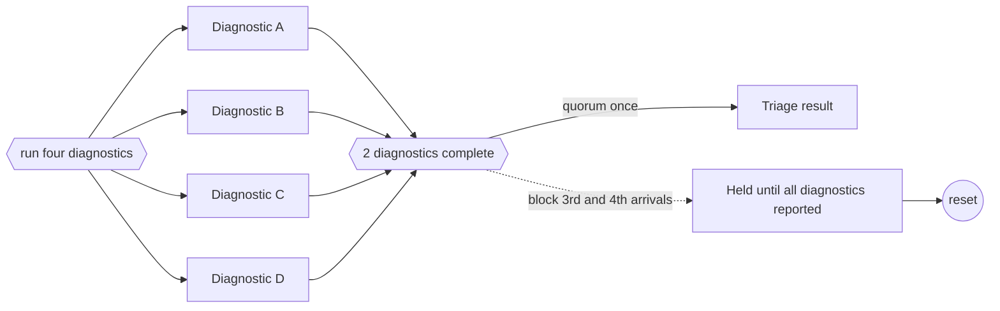

---
title: "Blocking Partial Join"
category: "[[Control-Flow/_Control-Flow Patterns|Control-Flow Patterns]]"
group: "Advanced Branching and Synchronization Patterns"
---
**Intent:** Continue when a threshold number of branches complete, then block later arrivals until the join resets.

**Use when:** A quorum should release the continuation once, but later branch completions must be prevented from passing through during the same branch set.

**Modeling notes:** Blocking makes the join stricter than a structured partial join. It avoids duplicate continuation while preserving late work for controlled handling.

Source: [workflowpatterns.com](http://workflowpatterns.com/patterns/control/new/wcp31.php).
