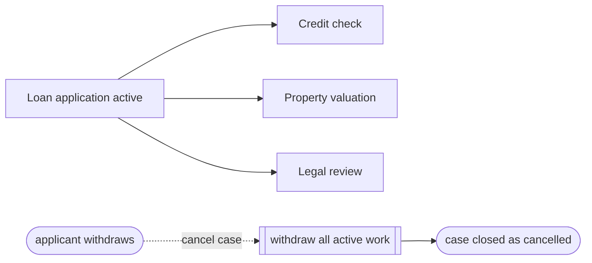

---
title: "Cancel Case"
category: "[[Control-Flow/_Control-Flow Patterns|Control-Flow Patterns]]"
group: "Cancellation and Force Completion Patterns"
---
**Intent:** Terminate the entire workflow case and withdraw all enabled or running work.

**Use when:** The case is invalid, withdrawn, superseded, or otherwise must stop completely.

**Modeling notes:** Case cancellation is broader than explicit termination because it removes outstanding work as part of stopping the case. Model notifications and external cleanup where required.

Source: [workflowpatterns.com](http://workflowpatterns.com/patterns/control/cancellation/wcp20.php).
