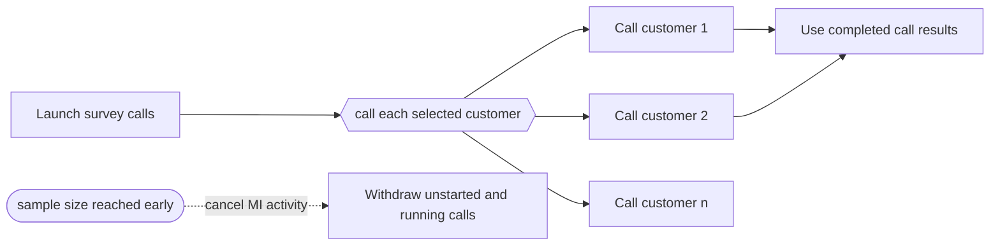

---
title: "Cancel Multiple Instance Activity"
category: "[[Control-Flow/_Control-Flow Patterns|Control-Flow Patterns]]"
group: "Cancellation and Force Completion Patterns"
---
**Intent:** Cancel all remaining instances of a multiple-instance activity.

**Use when:** A batch of identical work items should stop as a group before all instances finish.

**Modeling notes:** The target is the multi-instance activity, not a single instance. Completed instances remain completed; enabled or running instances are withdrawn.

Source: [workflowpatterns.com](http://workflowpatterns.com/patterns/control/new/wcp26.php).
