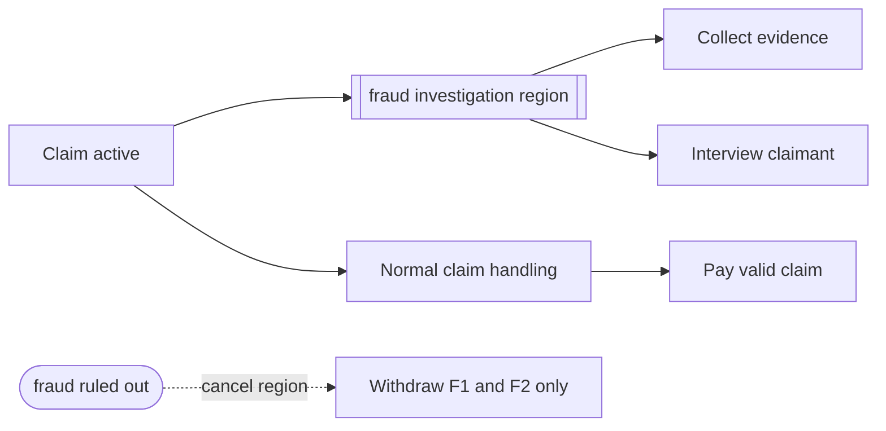

---
title: "Cancel Region"
category: "[[Control-Flow/_Control-Flow Patterns|Control-Flow Patterns]]"
group: "Cancellation and Force Completion Patterns"
---
**Intent:** Cancel all work inside a defined workflow region while allowing work outside the region to continue.

**Use when:** A subprocess, branch group, or scoped phase becomes irrelevant but the broader case remains valid.

**Modeling notes:** Define the region boundary clearly. Tasks outside the boundary should not be cancelled by the region event.

Source: [workflowpatterns.com](http://workflowpatterns.com/patterns/control/new/wcp25.php).
