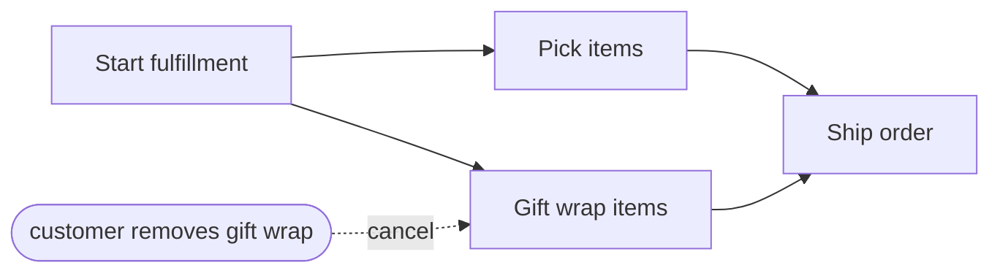

---
title: "Cancel Task"
category: "[[Control-Flow/_Control-Flow Patterns|Control-Flow Patterns]]"
group: "Cancellation and Force Completion Patterns"
---
**Intent:** Withdraw one enabled or running task instance while the rest of the case continues.

**Use when:** A specific task is no longer needed, invalid, or impossible, but the case itself remains alive.

**Modeling notes:** Show the cancellation trigger and target task. If the task has side effects, model cleanup or compensation separately.

Source: [workflowpatterns.com](http://workflowpatterns.com/patterns/control/cancellation/wcp19.php).
