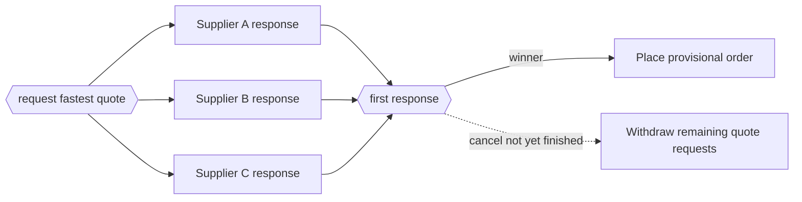

---
title: "Cancelling Discriminator"
category: "[[Control-Flow/_Control-Flow Patterns|Control-Flow Patterns]]"
group: "Advanced Branching and Synchronization Patterns"
---
**Intent:** Continue on the first arriving branch and cancel all remaining branches in the same branch set.

**Use when:** The first satisfactory result makes outstanding alternatives unnecessary or wasteful.

**Modeling notes:** Cancellation is part of the pattern, not an exception. Use it only where aborting the unfinished branches is acceptable and leaves no required cleanup unmodeled.

Source: [workflowpatterns.com](http://workflowpatterns.com/patterns/control/new/wcp29.php).
