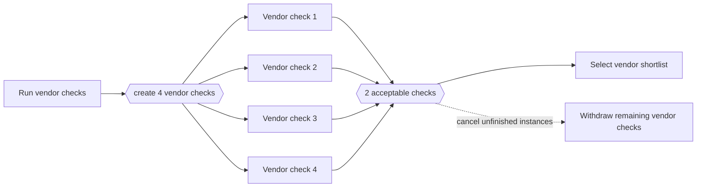

---
title: "Cancelling Partial Join for Multiple Instances"
category: "[[Control-Flow/_Control-Flow Patterns|Control-Flow Patterns]]"
group: "Multiple Instance Patterns"
---
**Intent:** Continue after the required number of multiple activity instances completes and cancel the rest.

**Use when:** Late instances have no value once the threshold is met.

**Modeling notes:** Make the cancellation visible because it affects user work, external calls, and compensation. This is a force-completion behavior for the multi-instance activity.

Source: [workflowpatterns.com](http://workflowpatterns.com/patterns/control/new/wcp35.php).
