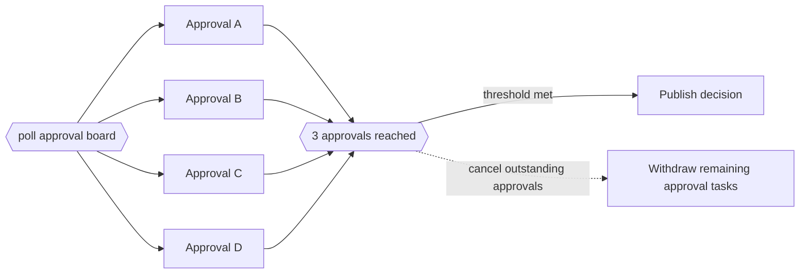

---
title: "Cancelling Partial Join"
category: "[[Control-Flow/_Control-Flow Patterns|Control-Flow Patterns]]"
group: "Advanced Branching and Synchronization Patterns"
---
**Intent:** Continue when a threshold number of branches complete and cancel all still-running branches.

**Use when:** A quorum is enough and additional results are no longer valuable after the threshold is reached.

**Modeling notes:** The cancellation boundary must be explicit because unfinished activities may need compensation, notifications, or resource release.

Source: [workflowpatterns.com](http://workflowpatterns.com/patterns/control/new/wcp32.php).
