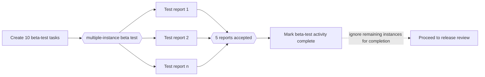

---
title: "Complete Multiple Instance Activity"
category: "[[Control-Flow/_Control-Flow Patterns|Control-Flow Patterns]]"
group: "Cancellation and Force Completion Patterns"
---
**Intent:** Force a multiple-instance activity to complete once its completion condition is satisfied.

**Use when:** Enough instances have finished to satisfy the business rule and the activity should be treated as complete even if other instances remain.

**Modeling notes:** This is a force-completion pattern: the multiple-instance activity reaches completed state, and remaining instances are no longer relevant to that activity's completion.

Source: [workflowpatterns.com](http://workflowpatterns.com/patterns/control/new/wcp27.php).
