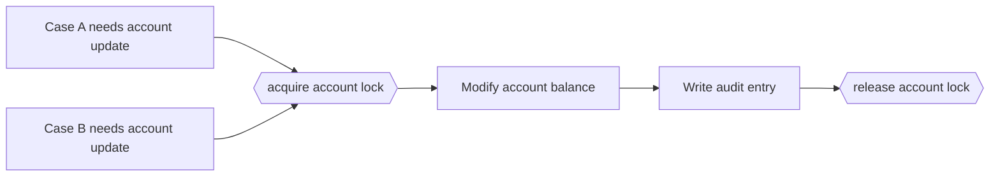

---
title: "Critical Section"
category: "[[Control-Flow/_Control-Flow Patterns|Control-Flow Patterns]]"
group: "State-based Patterns"
---
**Intent:** Prevent two or more parts of a workflow from entering a protected section at the same time.

**Use when:** A group of activities must have exclusive access to shared state or resources.

**Modeling notes:** Treat entry and exit as lock boundaries. The protected section should be as small as possible and must define what happens if work inside it fails or is cancelled.

Source: [workflowpatterns.com](http://workflowpatterns.com/patterns/control/new/wcp39.php).
