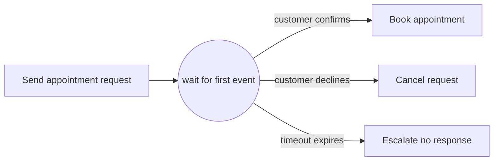

---
title: "Deferred Choice"
category: "[[Control-Flow/_Control-Flow Patterns|Control-Flow Patterns]]"
group: "State-based Patterns"
---
**Intent:** Leave a choice unresolved until one of several events occurs.

**Use when:** The environment, not an internal data condition, determines which path the case takes.

**Modeling notes:** The alternatives race while the case is waiting. Once one event is accepted, the other alternatives are no longer available for that decision.

Source: [workflowpatterns.com](http://workflowpatterns.com/patterns/control/state/wcp16.php).
