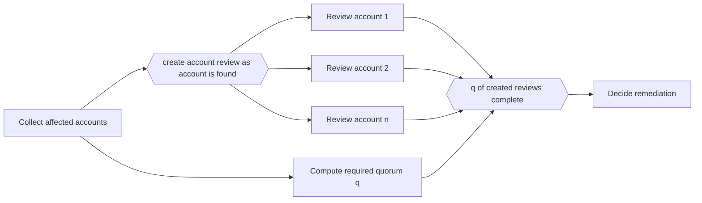

---
title: "Dynamic Partial Join for Multiple Instances"
category: "[[Control-Flow/_Control-Flow Patterns|Control-Flow Patterns]]"
group: "Multiple Instance Patterns"
---
**Intent:** Continue after a runtime-defined threshold of dynamically created instances completes.

**Use when:** Both the number of instances and the required completion count depend on data discovered during execution.

**Modeling notes:** The process must define when no more instances can be added and how the threshold is calculated. Model the threshold expression, not just the join symbol.

Source: [workflowpatterns.com](http://workflowpatterns.com/patterns/control/new/wcp36.php).
