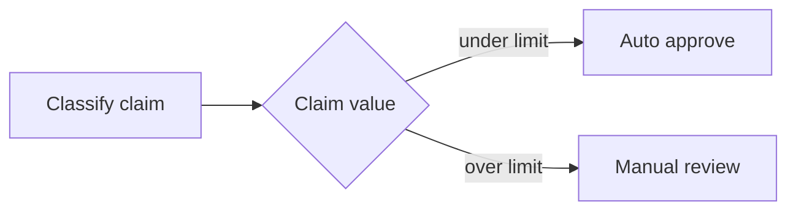

---
title: "Exclusive Choice"
category: "[[Control-Flow/_Control-Flow Patterns|Control-Flow Patterns]]"
group: "Basic Control Flow Patterns"
---
**Intent:** Select exactly one outgoing branch based on workflow data or a decision.

**Use when:** The alternatives are mutually exclusive and the case must follow one, and only one, path.

**Modeling notes:** Put the decision condition at the gateway or decision activity, not in the labels of downstream tasks. Ensure the conditions are complete and non-overlapping, including an explicit default when needed.

Source: [workflowpatterns.com](http://workflowpatterns.com/patterns/control/basic/wcp4.php).
