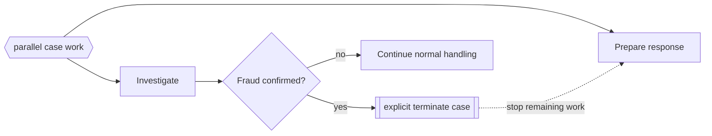

---
title: "Explicit Termination"
category: "[[Control-Flow/_Control-Flow Patterns|Control-Flow Patterns]]"
group: "Termination Patterns"
---
**Intent:** End the case by reaching an explicit terminating construct, cancelling any remaining work if necessary.

**Use when:** A modeled outcome should stop the whole case immediately, regardless of other active branches.

**Modeling notes:** Explicit termination is stronger than simply reaching an end node on one branch. Show that active sibling work is terminated so readers do not assume it continues.

Source: [workflowpatterns.com](http://workflowpatterns.com/patterns/control/new/wcp43.php).
