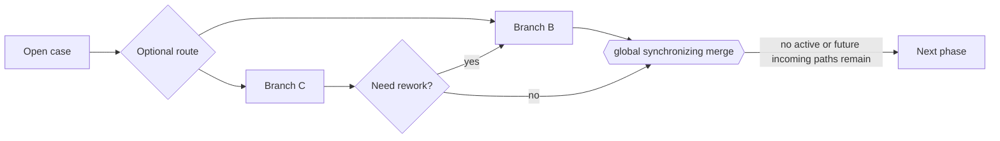

---
title: "General Synchronizing Merge"
category: "[[Control-Flow/_Control-Flow Patterns|Control-Flow Patterns]]"
group: "Advanced Branching and Synchronization Patterns"
---
**Intent:** Merge optional branches correctly even when the active incoming set can only be determined from the wider process state.

**Use when:** Optional branches, loops, or non-local dependencies mean the merge must inspect global runtime state to know what can still arrive.

**Modeling notes:** This pattern has the same visible purpose as a synchronizing merge but with general, non-local semantics. It is difficult for simple workflow engines because it requires reachability analysis at runtime.

Source: [workflowpatterns.com](http://workflowpatterns.com/patterns/control/new/wcp38.php).
