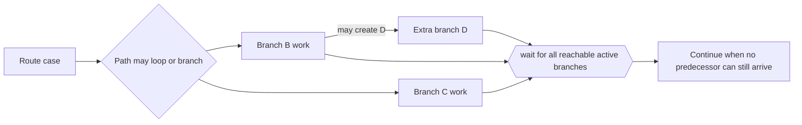

---
title: "Generalised AND-Join"
category: "[[Control-Flow/_Control-Flow Patterns|Control-Flow Patterns]]"
group: "Advanced Branching and Synchronization Patterns"
---
**Intent:** Synchronize all branches that can still arrive in a model where the active incoming set is not statically obvious.

**Use when:** Complex routing, loops, or non-local dependencies make a fixed AND-join too rigid but the continuation still needs all possible active predecessors.

**Modeling notes:** The join must reason over runtime reachability: wait for branches that are active or can still become active, and do not wait for impossible branches. This is powerful but hard to implement and verify.

Source: [workflowpatterns.com](http://workflowpatterns.com/patterns/control/new/wcp33.php).
