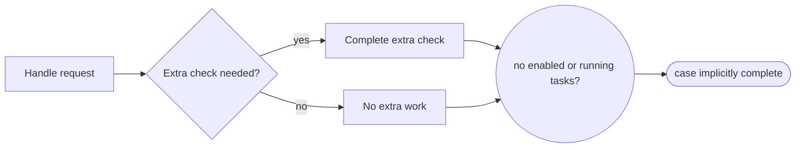

---
title: "Implicit Termination"
category: "[[Control-Flow/_Control-Flow Patterns|Control-Flow Patterns]]"
group: "Termination Patterns"
---
**Intent:** Complete the case automatically when no enabled or running work remains.

**Use when:** The process model does not need a dedicated end activity and completion can be inferred from absence of remaining work.

**Modeling notes:** Be careful with optional branches, fire-and-forget work, and cancellation because they affect whether work is still considered outstanding.

Source: [workflowpatterns.com](http://workflowpatterns.com/patterns/control/structural/wcp11.php).
