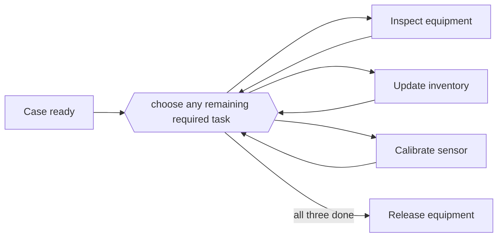

---
title: "Interleaved Parallel Routing"
category: "[[Control-Flow/_Control-Flow Patterns|Control-Flow Patterns]]"
group: "State-based Patterns"
---
**Intent:** Execute several required activities in any order while ensuring that no two are active at the same time.

**Use when:** Activities are all needed but share a resource, workspace, or state that forbids concurrency.

**Modeling notes:** This is not a parallel split with a join. It represents a set of activities that can be interleaved sequentially until all are done.

Source: [workflowpatterns.com](http://workflowpatterns.com/patterns/control/state/wcp17.php).
