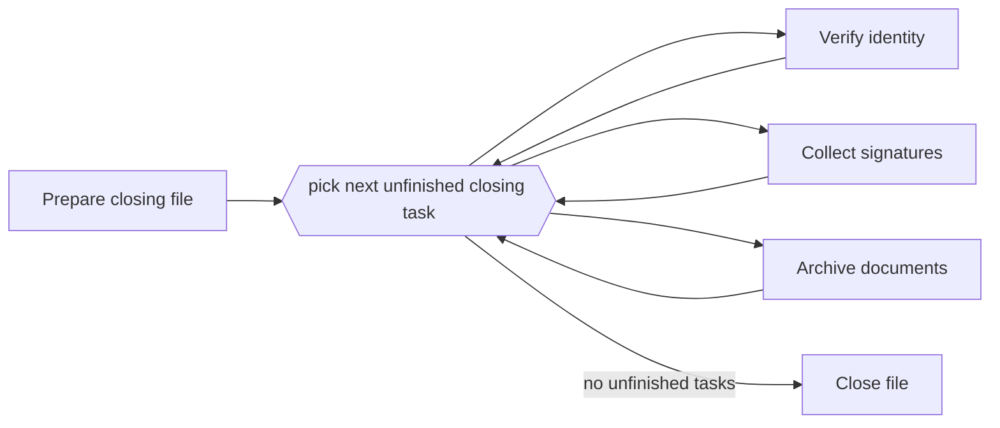

---
title: "Interleaved Routing"
category: "[[Control-Flow/_Control-Flow Patterns|Control-Flow Patterns]]"
group: "State-based Patterns"
---
**Intent:** Execute a set of activities one at a time in any order, without implying they were originally parallel.

**Use when:** A case has a checklist where users can choose the order, but the workflow must serialize execution.

**Modeling notes:** Compared with interleaved parallel routing, this variant emphasizes unordered sequential routing over a set rather than concurrent branches being interleaved. Model completion of the whole set explicitly.

Source: [workflowpatterns.com](http://workflowpatterns.com/patterns/control/new/wcp40.php).
