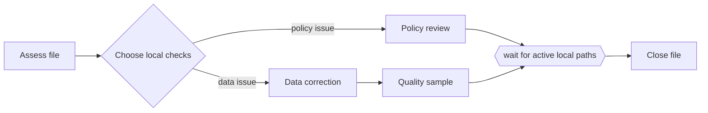

---
title: "Local Synchronizing Merge"
category: "[[Control-Flow/_Control-Flow Patterns|Control-Flow Patterns]]"
group: "Advanced Branching and Synchronization Patterns"
---
**Intent:** Synchronize the branches that are locally known to be active in an acyclic fragment.

**Use when:** A merge follows optional branching in a local region where future arrivals can be determined without analyzing the whole process model.

**Modeling notes:** This is less restrictive than the structured synchronizing merge because the split and join need not be a perfectly nested block. It still relies on local acyclic structure to determine which branches to wait for.

Source: [workflowpatterns.com](http://workflowpatterns.com/patterns/control/new/wcp37.php).
