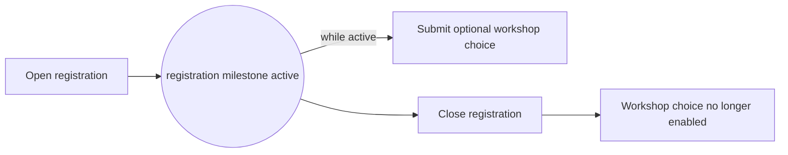

---
title: "Milestone"
category: "[[Control-Flow/_Control-Flow Patterns|Control-Flow Patterns]]"
group: "State-based Patterns"
---
**Intent:** Enable an activity only while the case is in a particular state.

**Use when:** A task is valid during a window of opportunity and must not start before the milestone is reached or after it has passed.

**Modeling notes:** The milestone is a state condition, not just a preceding activity. Model what opens and closes the milestone so the enabled task cannot leak outside the intended window.

Source: [workflowpatterns.com](http://workflowpatterns.com/patterns/control/state/wcp18.php).
