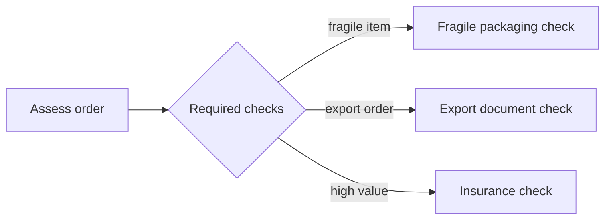

---
title: "Multi-Choice"
category: "[[Control-Flow/_Control-Flow Patterns|Control-Flow Patterns]]"
group: "Advanced Branching and Synchronization Patterns"
---
**Intent:** Enable any non-empty subset of several branches according to case data.

**Use when:** More than one optional activity may be required, but the exact combination differs per case.

**Modeling notes:** Unlike exclusive choice, several conditions may be true at once. Downstream joins must know which branches were actually enabled; a plain synchronization join can deadlock if it waits for branches that were never selected.

Source: [workflowpatterns.com](http://workflowpatterns.com/patterns/control/advanced_branching/wcp6.php).
