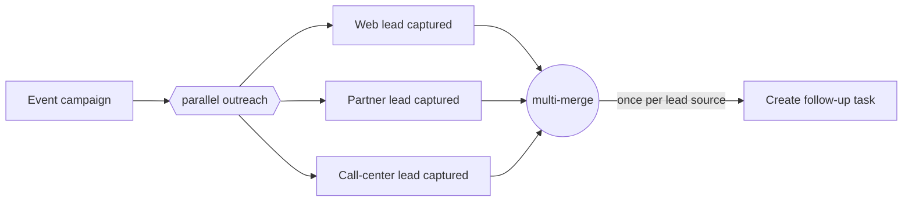

---
title: "Multi-Merge"
category: "[[Control-Flow/_Control-Flow Patterns|Control-Flow Patterns]]"
group: "Advanced Branching and Synchronization Patterns"
---
**Intent:** Let every arriving branch independently trigger the following activity.

**Use when:** Each branch completion should cause the same downstream action, and repeated executions are correct.

**Modeling notes:** Multi-merge is not a synchronization construct. If three branches arrive, the next activity is enabled three times; model idempotency or separate correlation if duplicate effects would be harmful.

Source: [workflowpatterns.com](http://workflowpatterns.com/patterns/control/advanced_branching/wcp8.php).
